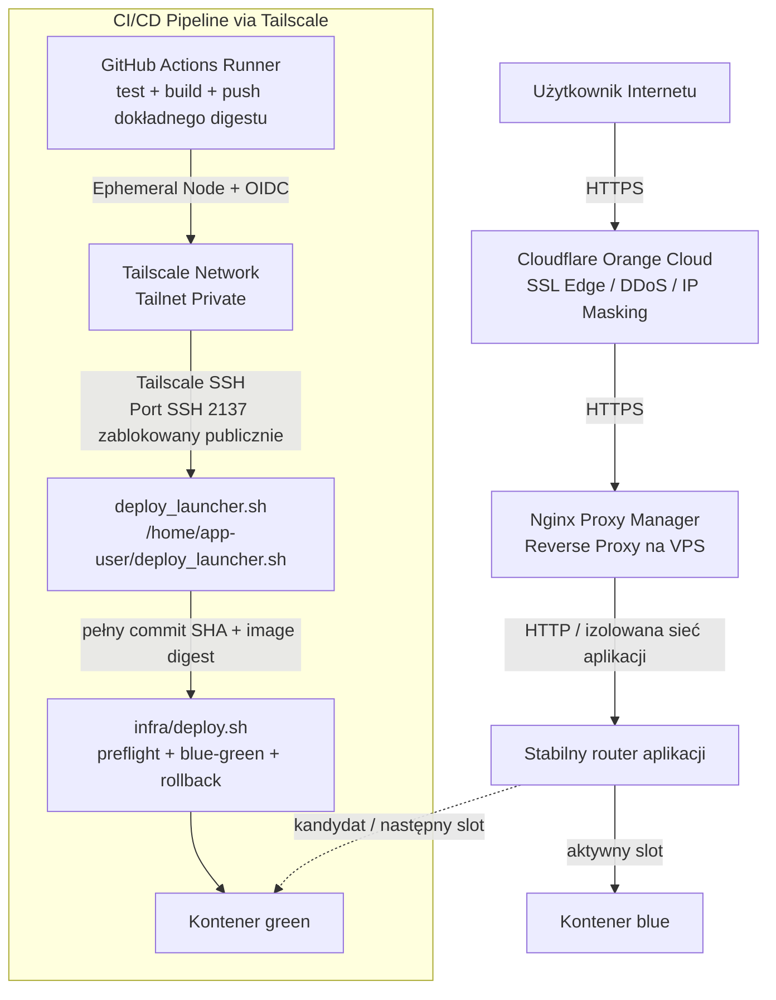

# Plan wdrożenia poprawek i standardu DevOps w repozytoriach portfolio Szczepana Greli (Wersja 11)

> [!NOTE]
> Ten dokument stanowi **zintegrowaną długoterminową mapę drogową (roadmapę)**. Będziemy realizować go krok po kroku (jedno repozytorium na raz). Łączy on prace programistyczne, dokumentacyjne oraz **znormalizowany standard produkcyjnego wdrożenia DevOps** dla wszystkich aplikacji internetowych i usługowych w domenie `grela.dev`.

> [!IMPORTANT]
> Kanoniczna wersja dokumentu znajduje się w publicznym repozytorium `grela-dev-roadmap`. Szczegółowe raporty i dane maszynowe projektów znajdują się w `projects/<slug>/`. Zaakceptowany standard rate limitingu opisuje [`rate-limiting-standard.md`](rate-limiting-standard.md), a maszynowo czytelne profile i kontrole v2 znajdują się w [`delivery-controls.json`](../standards/delivery-controls.json). Wartości są dobierane indywidualnie do kosztu endpointów.

---

## 🛠️ Znormalizowany Standard Architektury DevOps

Wszystkie wdrażane aplikacje webowe będą realizowane według jednolitego, bezpiecznego wzorca architektonicznego Zero-Trust:



### Kluczowe zasady DevOps dla przyszłych agentów AI:
1.  **Bezpieczeństwo sieciowe (Zero Trust & Tailscale OIDC):**
    *   Niestandardowy port SSH (`2137`) na VPS pozostaje zamknięty dla publicznego internetu.
    *   Wdrożenia CI/CD z GitHub Actions odbywają się wewnątrz prywatnej sieci Tailnet przy użyciu **Tailscale SSH** na port 2137.
    *   **Uwierzytelnianie: GitHub OIDC Federation (BEZ oauth-secret!):**
        *   Używamy akcji **`tailscale/github-action@v4`** (UWAGA: wersje `@v2` i `@v3` NIE obsługują parametru `audience` i wymagają `oauth-secret` — NIE UŻYWAĆ!).
        *   Akcja przyjmuje dwa parametry: `oauth-client-id` (Client ID) oraz `audience` (Audience URL). Nie wymaga żadnego tajnego klucza (`oauth-secret`/`tskey-client-...`).
        *   Job deployu MUSI mieć ustawione `permissions: { id-token: write, contents: read }`.
    *   **Konfiguracja OIDC Credential w Tailscale Admin Console** (dla każdego nowego repozytorium):
        1.  Wejdź w `Settings → Trust Credentials → Add OIDC Credential`.
        2.  **Tags:** Wybierz istniejący tag `tag:ci-vps` (dla VPS) lub `tag:ci-rbpi` (dla Raspberry Pi).
        3.  **Issuer:** wybierz w aktualnym formularzu dostawcę **GitHub Actions**. Konsola przypisze issuer `https://token.actions.githubusercontent.com`; nie wybieraj ręcznie „Custom issuer”, jeżeli preset GitHub Actions jest dostępny.
        4.  **Subject:** `repo:SzczepanGrela@115424220/<REPO_NAME>@<REPOSITORY_ID>:ref:refs/heads/main` (aktualny format z niezmiennym owner ID i repository ID; nazwa, ID oraz gałąź muszą być zgodne).
        5.  Zakres credentiala musi obejmować `auth_keys` i właściwy tag. Po zapisaniu Tailscale wygeneruje **Client ID** (np. `TcXhsYKQyJ11CNTRL-xxx`) oraz **Audience** (np. `api.tailscale.com/TcXhsYKQyJ11CNTRL-xxx`). Zapisz obie wartości. Client ID i Audience są identyfikatorami federacji, nie sekretami, ale dla spójności przechowujemy je w GitHub Actions Secrets.
        6.  Aktualny przepływ należy porównać z oficjalną dokumentacją [Tailscale GitHub Action](https://tailscale.com/docs/integrations/github/github-action) i [Workload identity federation](https://tailscale.com/docs/features/workload-identity-federation). Niniejszą instrukcję zweryfikowano 2026-08-24.
    *   **Reguły ACL w Tailscale:** Tag `tag:ci-vps` ma zezwolenie na ruch do `100.105.105.105` (VPS) na porcie `2137`. Tag `tag:ci-rbpi` ma zezwolenie na ruch do `100.104.104.104` (Raspberry Pi) na porcie `2137`.
    *   **Niezmienne GitHub IDs używane w OIDC:** owner `SzczepanGrela` = `115424220`; repozytoria: `inventory-generator` = `808164658`, `pos-order-system` = `808641042`, `netfilmx-movie-catalog` = `825161832`, `air-quality-app` = `940601553`, `audio-master` = `1010455644`, `tic-tac-toe-ai` = `1013262916`, `SmakoszWebApp` = `1014036592`, `UrlShortenerSystem` = `1015668631`, `OlxScrapper` = `1026959784`, `clean-commits-skill` = `1241862529`, `movie-rag` = `1241944352`, `leetcode` = `1258649476`, `SpotifyAdBlocker` = `1266821047`, `grela-dev` = `1296412137`. Po zmianie nazwy repo ID pozostaje bez zmian.
2.  **Struktura Repozytorium & Podział Skryptów Deployu (`/infra` Standard):**
    *   **Katalog `/infra` w repozytorium:** Wszystkie pliki konfiguracyjne i skrypty serwerowe (`Dockerfile`, `deploy.sh`, skrypty pomocnicze) **muszą znajdować się w katalogu `/infra`** wewnątrz repozytorium Git każdego projektu.
    *   **Podział na Launcher i Skrypt Główny:**
        *   `deploy-launcher.sh` — minimalny skrypt znajdujący się w katalogu domowym użytkownika na serwerze (`/home/<app-user>/deploy-launcher.sh`), wywoływany zdalnie przez GitHub Actions. Przyjmuje **pełny commit SHA i dokładny image digest**, waliduje ich format, pobiera wskazany commit zamiast ruchomego `origin/main`, a następnie uruchamia odpowiadający mu `/home/<app-user>/app/infra/deploy.sh`. Launcher nie pobiera skryptów ani konfiguracji z `raw.githubusercontent.com/.../main`.
        *   `infra/deploy.sh` — właściwy skrypt wdrożeniowy wewnątrz repozytorium w katalogu `/infra/`. Nie buduje ponownie obrazu na VPS: pobiera artefakt zbudowany i przetestowany w GitHub Actions po dokładnym digestcie, wykonuje preflight, przełączenie blue-green, weryfikację i ewentualny rollback. Odpowiada też za limity CPU/RAM oraz podłączenie usług do dedykowanej sieci.
        *   Skrypt pojedynczej aplikacji **nie wykonuje globalnego `docker image prune -f` bez polityki retencji**. Na współdzielonym VPS mogłoby to usunąć obraz potrzebny innej aplikacji lub do rollbacku. Obrazy są jednoznacznie tagowane (commit SHA/release), a sprzątanie ogranicza się do artefaktów danej aplikacji starszych niż ustalona retencja i następuje dopiero po udanym health checku.
3.  **Ochrona przed nadużyciami (Rate Limiting & DoS Protection):**
    *   **Każda publiczna aplikacja webowa** posiada zaimplementowany **Rate Limiting** zapobiegający przeciążeniom serwera, drenażowi zasobów i atakom typu DoS.
    *   Ochrona działa wielowarstwowo: Cloudflare Rate Limiting na krawędzi, Nginx Proxy Manager `limit_req` na poziomie reverse proxy oraz wbudowane middleware Rate Limiting w aplikacji (.NET `Microsoft.AspNetCore.RateLimiting` / Express / FastAPI).
    *   Szczególny nacisk położony jest na endpointy generujące pliki i zużywające CPU/RAM (np. `/api/export/docx`).
4.  **Izolacja systemowa (Dedykowane konta Linux):**
    *   Każdy projekt ma na serwerze VPS własnego użytkownika technicznego (np. `inventory-generator`, `movie-rag`, `smakosz`) należącego do grupy `docker`.
    *   Aplikacje są odizolowane w swoich katalogach domowych `/home/<app-user>/app/`.
    *   **Ważne:** członkostwo w grupie `docker` daje w praktyce uprawnienia równoważne rootowi. Osobne konto porządkuje własność i klucze, ale samo nie jest twardą granicą bezpieczeństwa. Docelowy hardening to rootless Docker albo bardzo wąskie polecenia przez `sudo`/kontrolowany launcher bez bezpośredniego dostępu do socketa Dockera.
5.  **Routing, SSL i Advanced Proxy Rules (Cloudflare + Nginx Proxy Manager):**
    *   **Cloudflare (Orange Cloud / Proxied):** Obsługuje certyfikaty SSL na krawędzi, chroni przed DDoS i ukrywa rzeczywiste IP serwera (Origin IP).
    *   **Jednoznaczny łańcuch prawdziwego IP klienta:** Ruch przebiega `użytkownik → Cloudflare → firewall VPS → NPM → aplikacja`. Publiczne porty `80/443` originu przyjmują ruch wyłącznie z aktualnych zakresów IPv4/IPv6 Cloudflare. Należy zweryfikować reguły `DOCKER-USER`/nftables, ponieważ samo UFW może nie obejmować portów publikowanych przez Dockera. Bezpośrednie połączenie z origin IP z hosta spoza Cloudflare ma się nie udać.
    *   **Normalizacja IP w NPM:** NPM ufa `CF-Connecting-IP` tylko wtedy, gdy bezpośrednim peerem jest adres z aktualnej listy Cloudflare (`set_real_ip_from`, `real_ip_header CF-Connecting-IP`). Moduł real-IP ustawia `$remote_addr` na adres odwiedzającego. Standardowy include proxy przekazuje następnie `X-Real-IP: $remote_addr` oraz dopisuje ten adres po prawej stronie `X-Forwarded-For`; aplikacja przetwarza łańcuch wyłącznie od zaufanego NPM i nie wybiera bezwarunkowo pierwszego elementu dostarczonego przez klienta.
    *   **Zaufanie aplikacji:** Framework aplikacji przyjmuje nagłówki proxy tylko od dokładnego adresu NPM w izolowanej sieci aplikacji. Ostatecznym `client_ip` używanym przez rate limiting i logi pozostaje IP faktycznego użytkownika. Cloudflare CIDR-y nie są wpisywane do `FORWARDED_ALLOW_IPS` aplikacji, bo Cloudflare nie łączy się z nią bezpośrednio; są weryfikowane warstwę wcześniej przez firewall i NPM. Zabronione jest `--forwarded-allow-ips "*"`.
    *   **Certyfikat SSL w NPM:** Używamy gotowego certyfikatu **`grela.dev wildcard (CF Origin)`** z włączonymi opcjami `Force SSL`, `HTTP/2 Support` oraz `HSTS Enabled`.
    *   **Jednolity Standard Przekierowań w NPM (Isolated App Networks + Container Name Forwarding):**
        *   **Dedykowana Sieć Dockerowa:** Każda aplikacja tworzy własną, wyizolowaną sieć Dockerową z myślnikami (np. `inventory-network`, `movierag-network`, `smakosz-network`).
        *   **Dołączenie Kontenera NPM:** Podczas wdrożenia kontener `nginx-proxy-manager` jest dynamicznie podłączany do dedykowanej sieci danej aplikacji (`docker network connect <app-network> nginx-proxy-manager`). Zapewnia to pełną izolację między różnymi aplikacjami na serwerze, jednocześnie umożliwiając NPM bezpieczny forwarding.
        *   **Forward Hostname w NPM:** W NPM wpisujemy zawsze **nazwę kontenera Docker** (np. `inventory-generator:8080`, `movierag-frontend:80`, `movierag-api:8000`), eliminuje to kolizje portów na hoście.
        *   *Wielokontenerowe aplikacje (np. `movie-rag`, `smakosz-web-app`):* Użycie **Custom Locations** w NPM do rozdzielania ruchu po nazwach kontenerów (np. `/` -> `movierag-frontend:80`, `/api/*` -> `movierag-api:8000`).
        *   *Zaawansowane reguły proxy (Advanced / Directives):* Dla endpointów LLM / RAG / SSE wyłączamy buforowanie (`proxy_buffering off;`, `chunked_transfer_encoding off;`) i zwiększamy timeout (`proxy_read_timeout 300s;`).
6.  **Zarządzanie sekretami i higiena Dockera:**
    *   **Standaryzowane Sekrety Repozytorium w GitHub Actions (bez hardcoded defaults w kodzie):**
        *   `TS_CLIENT_ID` — Client ID z OIDC Credential w Tailscale Admin Console (np. `TcXhsYKQyJ11CNTRL-xxx`).
        *   `TS_AUDIENCE` — Audience URL z OIDC Credential (np. `api.tailscale.com/TcXhsYKQyJ11CNTRL-xxx`).
        *   `SSH_PRIVATE_KEY` — Zawartość dedykowanego klucza prywatnego SSH (ed25519) odpowiadającego plikowi `authorized_keys` na VPS.
        *   `SSH_HOST` — IP w sieci Tailnet (`100.105.105.105`) lub nazwa węzła Tailscale.
        *   `SSH_PORT` — Niestandardowy port SSH (`2137`).
        *   `SSH_USER` — Dedykowany użytkownik aplikacji na VPS (np. `inventory-generator`).
        *   `SSH_KNOWN_HOSTS` — wcześniej zweryfikowany wpis host key dla docelowej nazwy/IP i portu; nie pobieramy go bez weryfikacji w tym samym jobie, który ma mu zaufać.
    *   **UWAGA: NIE używamy `TS_OAUTH_SECRET` / `oauth-secret` / `tskey-client-...`** — dzięki OIDC Federation w `@v4` ten klucz nie jest potrzebny.
    *   **Zmienne środowiskowe na serwerze:** Plik `/home/<app-user>/app/.env` (prawa dostępu `600`, poza systemem kontroli wersji Git).
    *   **Retencja obrazów:** Zachowujemy co najmniej ostatni sprawdzony obraz rollbacku. Czyszczenie jest per aplikacja, po udanym wdrożeniu i według czasu/etykiety; nie uruchamiamy bezwarunkowego globalnego prune z każdego deployu.
7.  **Niezmienny release, preflight i blue-green (obowiązkowy standard):**
    *   **Jeden build, jeden artefakt:** obraz powstaje raz w GitHub Actions po przejściu Quality, jest wysyłany do GHCR z tagiem pełnego commit SHA, a deploy używa postaci `ghcr.io/...@sha256:...`. Produkcja nie wdraża `latest`, skróconego SHA ani obrazu zbudowanego ponownie na VPS.
    *   **Manifest wydania:** wielokontenerowa aplikacja publikuje niezmienny manifest zawierający pełny `CONFIG_SHA` oraz digest każdego obrazu. Przy buildach selektywnych manifest przenosi digests niezmienionych komponentów; prostszym i bezpieczniejszym początkiem jest atomowe zbudowanie wszystkich kontenerów aplikacyjnych.
    *   **Spójność commitu:** workflow, obrazy, Compose, konfiguracja i `deploy.sh` muszą pochodzić z tego samego SHA. Launcher nigdy nie zastępuje SHA przekazanego przez job aktualnym stanem `main`.
    *   **Preflight przed zmianą ruchu:** nieaktywny slot (`blue` albo `green`) startuje równolegle pod unikalną nazwą z limitami zasobów i bez produkcyjnego aliasu. Skrypt czeka na Docker healthcheck, odpytuje `/health/ready` i wykonuje bezpośredni smoke test krytycznych ścieżek. Nie usuwa ani nie restartuje działającego slotu. Nie wolno sprawdzić kandydata, usunąć go, a następnie uruchomić w produkcji nowego, niesprawdzonego kontenera z tego samego obrazu.
    *   **Promocja blue-green:** po udanym preflight stabilny router aplikacji przełącza upstream z aktywnego slotu na kandydata atomowym reloadem. NPM wskazuje stabilny router/gateway, a nie slot. Następnie wykonywany jest smoke test przez publiczny HTTPS; przy błędzie routing wraca do poprzedniego slotu. Stary slot jest zatrzymywany dopiero po okresie drain/grace i pozostaje dostępny jako ostatni release rollbacku zgodnie z retencją.
    *   **Zakres blue-green:** dublujemy stateless frontend/API. PostgreSQL, kolejki i monitoring pozostają współdzielone. Worker/orchestrator uruchamiający zadania cykliczne działa jako singleton albo używa leader election/distributed lock; dwa sloty nie mogą podwójnie wykonać tego samego zadania.
    *   **Hosting statyczny:** dla GitHub Pages/Cloudflare Pages odpowiednikiem jest preview deployment z testami, a następnie atomowa promocja i rollback zapewniane przez platformę. Nie dokładamy własnych kontenerów ani routera blue-green tam, gdzie hosting już gwarantuje niezmienne wydania.
    *   **Migracje bazy:** migracje nie uruchamiają się automatycznie przy starcie każdej repliki. Są osobnym, kontrolowanym krokiem po backupie. Stosujemy expand/contract: najpierw zmiana kompatybilna ze starą i nową wersją, później deploy kodu, a destrukcyjne usunięcia dopiero w osobnym wydaniu. Rollback aplikacji nie może wymagać cofania nieodwracalnej migracji.
    *   **Healthcheck:** `/health/live` potwierdza tylko życie procesu; do promocji obowiązkowy jest `/health/ready` sprawdzający wymagane zależności. Po przełączeniu wymagany jest zewnętrzny smoke test przez Cloudflare → NPM → aplikację.
    *   **Blokady i współbieżność:** GitHub `concurrency` serializuje wdrożenia danego środowiska z `cancel-in-progress: false`. Serwer dodatkowo używa prawdziwego `flock`: per aplikacja oraz wspólnej, wcześniej przygotowanej blokady VPS na okres największego zużycia RAM. Zapisanie PID do zwykłego pliku nie jest blokadą.
    *   **Budżet zasobów:** oba sloty mają jawne limity CPU, RAM i PID. Podwójne zużycie dotyczy tylko dublowanych usług w trakcie wdrożenia i okresu rollback/drain, nie bazy i pozostałych usług stanowych. Deploy nie rozpoczyna kandydata, jeżeli serwer nie ma ustalonego zapasu pamięci.
    *   **Bezpieczne sprzątanie:** brak globalnego `docker image prune -f`, brak bezwarunkowego restartu NPM i brak aktualizacji współdzielonej infrastruktury przy deployu pojedynczej aplikacji. Obrazy baz danych i monitoringu są przypięte do kontrolowanych wersji/digestów i aktualizowane osobnym procesem. Czyszczenie jest per aplikacja, po sukcesie, z zachowaniem co najmniej ostatniego działającego release'u.
    *   **Kontrola wydania:** `main` ma ruleset blokujący force-push i usunięcie oraz wymagający zielonego Quality przed scaleniem. Dla jednoosobowych repozytoriów nie wymagamy zatwierdzenia przez inną osobę: docelowy przepływ to PR bez obowiązkowego review, zielone wymagane kontrole i merge. Jeżeli projekt tymczasowo zachowuje bezpośrednie pushe na `main`, minimalny etap przejściowy blokuje force-push i usunięcie, a Quality pozostaje kontrolą po pushu; nie opisujemy tego wariantu jako pełnej ochrony przed wadliwym commitem. Deploy korzysta z GitHub Environment `production`; sekrety produkcyjne są przypisane do środowiska, uprawnienia workflow są minimalne, a klucz hosta SSH jest przypięty w `SSH_KNOWN_HOSTS`.
    *   **Kryterium akceptacji:** celowe uszkodzenie readiness kandydata nie przerywa ruchu do starej wersji; błąd publicznego smoke testu automatycznie cofa routing; ponowienie tego samego manifestu wdraża dokładnie te same digests; równoległy deploy innego repozytorium respektuje blokadę pojemności VPS.
8.  **Referencyjny szkielet `.github/workflows/deploy.yml`:**
    ```yaml
    deploy:
      name: Deploy to VPS
      needs: [test-and-build, build-docker-image]
      if: github.ref == 'refs/heads/main' && github.event_name == 'push'
      runs-on: ubuntu-latest
      concurrency:
        group: production-${{ github.repository }}
        cancel-in-progress: false
      environment: production
      permissions:
        contents: read
        id-token: write
      steps:
        - name: Connect to Tailscale
          uses: tailscale/github-action@v4
          with:
            oauth-client-id: ${{ secrets.TS_CLIENT_ID }}
            audience: ${{ secrets.TS_AUDIENCE }}
            tags: tag:ci-vps
            ping: ${{ secrets.SSH_HOST }}
        - name: Setup SSH key
          run: |
            mkdir -p ~/.ssh
            echo "${{ secrets.SSH_PRIVATE_KEY }}" > ~/.ssh/deploy_key
            chmod 600 ~/.ssh/deploy_key
            printf '%s\n' "${{ secrets.SSH_KNOWN_HOSTS }}" > ~/.ssh/known_hosts
        - name: Deploy and verify
          env:
            RELEASE_SHA: ${{ github.sha }}
            IMAGE_REF: ghcr.io/SzczepanGrela/REPOSITORY@${{ needs.build-docker-image.outputs.digest }}
          run: |
            ssh -i ~/.ssh/deploy_key -p ${{ secrets.SSH_PORT }} \
              ${{ secrets.SSH_USER }}@${{ secrets.SSH_HOST }} \
              bash /home/${{ secrets.SSH_USER }}/deploy-launcher.sh "$RELEASE_SHA" "$IMAGE_REF"
    ```

    Job `build-docker-image` musi wystawiać digest obrazu jako output. Dla wielu obrazów przekazujemy podpisany lub jednoznacznie identyfikowany manifest release'u zamiast rosnącej listy parametrów SSH.

9.  **Centralna obserwowalność VPS (jeden stack dla wszystkich aplikacji):**
    *   Na jednym VPS utrzymujemy **jedną niezależną instancję Grafany, Prometheusa i Node Exportera na środowisko**, a nie ich kopię w każdym projekcie. Opcjonalne usługi, takie jak Grafana Image Renderer, cAdvisor, Loki/Alloy lub Alertmanager, również należą do centralnego stacku. Osobne instancje tworzymy dopiero dla innego środowiska, hosta, wymogu izolacji albo skali uzasadniającej federację.
    *   Stack działa z osobnego katalogu i Compose/repozytorium infrastruktury, np. `/home/observability`, pod osobnym cyklem wdrożeniowym. Deploy aplikacji nie restartuje, nie aktualizuje ani nie usuwa kontenerów obserwowalności.
    *   Grafana, renderer, Prometheus i hostowe exportery korzystają z dedykowanej zewnętrznej sieci `observability-network`. Prometheus jest dodatkowo dołączany tylko do tych izolowanych sieci aplikacji, z których musi pobierać wewnętrzne `/metrics`; pozostałe aplikacje nadal nie uzyskują wzajemnej łączności. Endpointy metryk i interfejs Prometheusa nie są publikowane do internetu, a Grafana pozostaje dostępna wyłącznie przez Tailscale lub chroniony reverse proxy.
    *   Każdy scrape target otrzymuje spójne labels: co najmniej `application`, `service`, `environment` i `instance`. Konfiguracja dzieli dashboardy i reguły alertów na foldery per aplikacja oraz zapewnia dashboardy globalne dla hosta, wszystkich kontenerów, dostępności, błędów HTTP, wykorzystania zasobów i historii deploymentów.
    *   Node Exporter działa dokładnie raz na host. Do metryk CPU/RAM/restartów poszczególnych kontenerów dodajemy jeden centralny cAdvisor, jeżeli jego koszt i zakres dostępu do Dockera zostaną zaakceptowane. Grafana Unified Alerting może pozostać mechanizmem alertów; osobny Alertmanager nie jest obowiązkowy na pojedynczym VPS.
    *   Prometheus ma ustaloną retencję, limit pamięci i budżet dysku dobrane po pomiarze cardinality całego VPS. Monitoring wolnego miejsca, OOM/restartów oraz samego Prometheusa jest obowiązkowy. Obrazy są przypięte do kontrolowanych wersji/digestów i aktualizowane niezależnie od aplikacji.
    *   Dashboardy, provisioning i reguły alertów są wersjonowane; sekrety Grafany/SMTP pozostają w pliku środowiskowym z prawami `600`. Wolumeny Grafany i Prometheusa mają backup oraz przetestowaną procedurę odtworzenia.
    *   Migracja istniejącego monitoringu odbywa się bez utraty obserwacji aplikacji: najpierw backup/snapshot i równoległy centralny kandydat na nowych nazwach/sieci, następnie porównanie scrape targets, dashboardów oraz alertów, przełączenie dostępu do Grafany i dopiero na końcu usunięcie usług z Compose aplikacji. Stary stack pozostaje dostępny do rollbacku przez ustalony okres; ewentualna krótka przerwa dotyczy wyłącznie narzędzi monitoringu, nie ruchu aplikacji.

---

## 🤝 Zasady Współpracy i Kontroli Użytkownika

> [!IMPORTANT]
> **Pełna kontrola użytkownika (Brak samodzielnych decyzji AI):**
> *   Każda zmiana w kodzie (np. logika tabel w Wordzie, interfejs NetFilmx, scrapery) będzie przedyskutowana z Tobą **przed jej zaimplementowaniem**. Agent AI nie będzie samodzielnie podejmował decyzji o architekturze ani dokonywał zmian bez Twojej wiedzy.
> *   Wszelkie commity i wypchnięcie zmian na GitHub (`git commit` / `git push`) oraz zmiany nazw repozytoriów będą wykonywane **dopiero po Twojej wyraźnej akceptacji** konkretnego pliku/kodu lub jako polecenie uruchomione przez Ciebie w terminalu.
> *   Działamy ściśle w trybie **Pair Programming** — AI proponuje rozwiązania i pisze kod do wglądu, a Ty pełnisz rolę zatwierdzającego (Driver/Navigator).

---

## 🗂️ Organizacja pracy (Rozdzielenie czatów)

Aby zapobiec przepełnieniu kontekstu (tzw. context bloating) i utrzymać wysoką wydajność:
1.  **Ten czat** służy jako **Koordynator Główny** — tu śledzimy postępy na roadmapie, zarządzamy listą zadań i podejmujemy decyzje strategiczne.
2.  **Dla każdego konkretnego kroku** zalecamy **otwieranie osobnego, świeżego czatu**. Przyszły agent AI odczytuje kanoniczny plik `/home/szcze/projects/grela-dev-roadmap/docs/implementation-plan.md` i raport danego projektu z `projects/<slug>/report.md`, a następnie dostosowuje się do standardu DevOps.

---

## Proposed Changes (Chronologiczna kolejność prac)

### 1. `Projekt-ST1-Generator-Spisu` -> `inventory-generator` ✅ **[UKOŃCZONE]**
*   **Proponowana nazwa:** `inventory-generator`
*   **Subdomena:** `inventory.grela.dev` (lub `spis.grela.dev`)
*   **Port kontenera:** `127.0.0.1:8080`
*   **Konto Linux na VPS:** `inventory-app`
*   **Technologia:** C# (WinForms) + biblioteka Word
*   **Zadania Dev:** Zmiana nazwy na `inventory-generator`, licencja MIT, README.md (EN). Poprawa układu tabeli w plikach MS Word (szerokość kolumn, czcionki, obramowania), aby była czytelna i schludna.
*   **Zadania DevOps:** Stworzenie Dockerfile, `deploy.sh`, workflow `.github/workflows/deploy.yml` (Tailscale SSH), konfiguracja NPM & Cloudflare. Upewnienie się, że aplikacja ma favicon i wielowarstwowy rate limiting; wdrożenie obowiązkowego preflightu, blue-green i automatycznego rollbacku zgodnie ze standardem powyżej.

### 2. `Punkt_Skladania_Zamowien` (Maj 2024)
*   **Proponowana nazwa:** `pos-order-system`
*   **Dystrybucja:** Aplikacja desktopowa; bez publicznego hostingu i subdomeny.
*   **Technologia:** C# (WinForms)
*   **Zadania Dev:** Zmiana nazwy na `pos-order-system`, licencja MIT, README.md (EN) z datą, tagi, audyt znanych błędów, testy logiki oraz przygotowanie powtarzalnego wydania desktopowego.
*   **Zadania DevOps:** Quality CI dla kompilacji i testów oraz automatyzacja artefaktu wydania. Standard webowego rate limitingu, NPM, favicon i blue-green nie ma zastosowania.

### 3. `ST2-NetFilmx` (Lipiec 2024)
*   **Proponowana nazwa:** `netfilmx-movie-catalog`
*   **Subdomena:** `netfilmx.grela.dev`
*   **Port kontenera:** `127.0.0.1:8082`
*   **Konto Linux na VPS:** `netfilmx-app`
*   **Technologia:** C# (ASP.NET Core MVC)
*   **Zadania Dev:** Zmiana nazwy na `netfilmx-movie-catalog`, licencja MIT, README.md (EN). Odświeżenie panelu admina (Admin UI) i dodanie estetycznego interfejsu dla zwykłych użytkowników (User UI).
*   **Zadania DevOps:** Wdrożenie kontenerowe ASP.NET Core MVC pod subdomenę `netfilmx.grela.dev`. Upewnienie się, że aplikacja ma favicon i wielowarstwowy rate limiting; wdrożenie obowiązkowego preflightu, blue-green i automatycznego rollbacku zgodnie ze standardem powyżej.

### 4. `AirQualityApp` (Luty 2025)
*   **Proponowana nazwa:** `air-quality-app`
*   **Subdomena:** `air.grela.dev`
*   **Port kontenera:** `127.0.0.1:8083`
*   **Konto Linux na VPS:** `airquality-app`
*   **Technologia:** Python
*   **Zadania Dev:** Zmiana nazwy na `air-quality-app`, licencja MIT, README.md (EN). Implementacja brakujących funkcjonalności (zapisywanie historii pomiarów, wykresy jakości powietrza w matplotlib/plotly).
*   **Zadania DevOps:** Konteneryzacja aplikacji Python i wdrożenie pod `air.grela.dev`. Upewnienie się, że aplikacja ma favicon i wielowarstwowy rate limiting; wdrożenie obowiązkowego preflightu, blue-green i automatycznego rollbacku zgodnie ze standardem powyżej.

### 5. `AudioMaster` (Czerwiec 2025)
*   **Proponowana nazwa:** `audio-master`
*   **Technologia:** Python (GUI + ffmpeg)
*   **Zadania Dev:** Zmiana nazwy na `audio-master`, licencja MIT, README.md (EN). **Współautorstwo:** Dodanie sekcji atrybucji współautorów.

### 6. `kolkokrzyzyk` (Lipiec 2025)
*   **Proponowana nazwa:** `tic-tac-toe-ai`
*   **Subdomena:** `tictactoe.grela.dev`
*   **Port kontenera:** `127.0.0.1:8084`
*   **Konto Linux na VPS:** `tictactoe-app`
*   **Technologia:** Python
*   **Zadania Dev:** Zmiana nazwy na `tic-tac-toe-ai`, licencja MIT, README.md (EN). **Współautorstwo:** Dodanie sekcji atrybucji współautorów.
*   **Zadania DevOps:** Wdrożenie wersji webowej gry pod `tictactoe.grela.dev`. Utrzymać token bucket ruchów (30/min z burstem 10), naliczać seriom koszt według liczby gier i zachować limit dwóch równoległych operacji AI. Zweryfikować Cloudflare/NPM i prawdziwe IP klienta, następnie przejść na Redis, niezmienne obrazy GHCR, readiness, stabilny gateway, blue-green i automatyczny rollback zgodnie ze standardem powyżej.

### 7. `SmakoszWebApp` (Lipiec 2025)
*   **Proponowana nazwa:** `smakosz-web-app`
*   **Domena:** obecnie planowane `smakosz.grela.dev`; wybrać docelową domenę i przeprowadzić kontrolowaną migrację bez wymyślania adresu przed decyzją właściciela.
*   **Konto Linux na VPS:** `smakosz-app`
*   **Technologia:** C# (.NET 10) + Blazor WASM (PWA) + PyTorch/ONNX + Docker
*   **Zadania Dev:** Zmiana nazwy na `smakosz-web-app`, licencja MIT, stworzenie obszernego README.md (EN) na podstawie Twojej pracy inżynierskiej (`2026.IN.w67131.pdf`). **Naprawa e-maili:** usunąć zależność od wygasłego klucza Brevo API i przejść na SMTP Brevo przez wydzieloną abstrakcję nadawcy (np. MailKit), sekrety środowiskowe, kolejkę/retry z idempotencją oraz testy potwierdzenia konta, resetu hasła i ponownego wysłania wiadomości. Zweryfikować domenę nadawcy, SPF, DKIM i DMARC; usunąć/wycofać stare dane API i nie logować poświadczeń SMTP.
*   **Zadania DevOps:** Naprawić CI/CD zgodnie z obowiązkowym standardem: wdrażać manifest pełnego SHA i dokładne digests zamiast `latest`; nie pobierać Compose/skryptów z ruchomego `main`; połączyć zduplikowany workflow force z parametrem ręcznym; wdrożyć preflight i blue-green dla klienta/API, singleton lub bezpieczny drain dla Hangfire orchestratora oraz osobny krok migracji EF w modelu expand/contract; używać readiness zamiast samego liveness; dodać automatyczny rollback i publiczny smoke test; zastąpić pozorną blokadę prawdziwym `flock`; usunąć globalny `docker image prune -f`, restart NPM przy każdym deployu i strefowe `purge_everything`; przypiąć obrazy infrastruktury i dodać limity zasobów. **Centralna obserwowalność:** wydzielić działające `smakosz-prometheus`, `smakosz-grafana`, `smakosz-grafana-renderer` i `smakosz-node-exporter` z Compose oraz sieci Smakosza do niezależnego stacku i `observability-network`, zachowując wolumeny, dashboardy, alerty SMTP i ciągłość monitorowania Smakosza; następnie dodać scrape targets, labels, dashboardy i alerty pozostałych aplikacji. Node Exporter pozostaje pojedynczy dla całego hosta, a opcjonalny centralny cAdvisor zapewnia metryki kontenerów. Migrację wykonać równoległym kandydatem, z backupem i rollbackiem, zanim usługi zostaną usunięte ze Smakosza. **Migracja domeny:** po wyborze adresu skonfigurować Cloudflare, NPM/TLS, CORS, callbacki, cookie domain, linki w wiadomościach i konfigurację PWA; utrzymać stary adres przez okres przejściowy z przekierowaniem, wykonać zewnętrzne testy HTTPS i dopiero potem wycofać starą domenę. **Refaktoryzacja sieci aplikacji:** zmienić `smakosz_network` na `smakosz-network` i ponownie przepiąć NPM; monitoring korzysta z odrębnej `observability-network`. Upewnić się, że aplikacja ma favicon i wielowarstwowy rate limiting.

### 8. `UrlShortenerSystem` (Lipiec 2025)
*   **Proponowana nazwa:** `url-shortener-system`
*   **Subdomena:** `s.grela.dev` (lub `shortener.grela.dev`)
*   **Port kontenera:** `127.0.0.1:8085`
*   **Konto Linux na VPS:** `shortener-app`
*   **Technologia:** C# (.NET) + HTML/JS/CSS (nowe UI)
*   **Zadania Dev:** Zmiana nazwy na `url-shortener-system`, licencja MIT, README.md (EN). Stworzenie prostego, responsywnego UI w HTML/JS do skracania linków.
*   **Zadania DevOps:** Wdrożenie produkcyjne API + UI pod subdomenę `s.grela.dev`. Upewnienie się, że aplikacja ma favicon i wielowarstwowy rate limiting; wdrożenie obowiązkowego preflightu, blue-green i automatycznego rollbacku zgodnie ze standardem powyżej.

### 9. `OlxScrapper` (Lipiec 2025)
*   **Proponowana nazwa:** `flat-finder`
*   **Subdomena:** `flatfinder.grela.dev`
*   **Port kontenera:** `127.0.0.1:8086`
*   **Konto Linux na VPS:** `flatfinder-app`
*   **Technologia:** Python + HTML
*   **Zadania Dev:** Zmiana nazwy na `flat-finder`, licencja MIT, README.md (EN). Uporządkowanie skryptów ML i scrapera, dokończenie skryptu treningowego i zintegrowanie go z aplikacją.
*   **Zadania DevOps:** Wdrożenie produkcyjne dashboardu wyszukiwarki mieszkań pod `flatfinder.grela.dev`. Upewnienie się, że aplikacja ma favicon i wielowarstwowy rate limiting; wdrożenie obowiązkowego preflightu, blue-green i automatycznego rollbacku zgodnie ze standardem powyżej.

### 10. `clean-commits-skill` (Maj 2026)
*   **Nazwa:** Bez zmian (`clean-commits-skill`)
*   **Zadania Dev:** Dodanie daty do README.md, licencja MIT, tagi.

### 11. `movie-rag` (Maj 2026)
*   **Nazwa:** Bez zmian (`movie-rag`)
*   **Subdomena:** `movierag.grela.dev`
*   **Port kontenera:** `127.0.0.1:8087`
*   **Konto Linux na VPS:** `movierag-app`
*   **Zadania Dev:** Dodanie daty do README.md, licencja MIT, schemat przepływu RAG.
*   **Zadania DevOps:** Konteneryzacja pipeline'u RAG i wdrożenie pod `movierag.grela.dev`. **Refaktoryzacja sieci:** Zmiana nazwy starej sieci `movierag_network` na znormalizowaną `movierag-network` (użycie myślników/pauz) i ponowne przepięcie kontenera NPM. Upewnienie się, że aplikacja ma favicon i wielowarstwowy rate limiting; wdrożenie obowiązkowego preflightu, blue-green i automatycznego rollbacku zgodnie ze standardem powyżej.

### 12. `leetcode` (Czerwiec 2026)
*   **Proponowana nazwa:** `leetcode-solutions`
*   **Zadania Dev:** Zmiana nazwy na `leetcode-solutions`, licencja MIT, README.md (EN) z indeksem zadań.

### 13. `SpotifyAdBlocker` (Czerwiec 2026)
*   **Proponowana nazwa:** `spotify-ad-blocker`
*   **Zadania Dev:** Dodanie daty do README.md, licencja MIT, usunięcie plików `.idea` i `.exe`.

### 14. `grela-dev` (Lipiec 2026 - Najnowszy)
*   **Nazwa:** Bez zmian (`grela-dev`)
*   **Domena:** `grela.dev` (Główna domena)
*   **Technologia:** HTML/JS (React/JSX)
*   **Zadania Dev:** Dodanie pliku `LICENSE` (MIT) oraz pliku README.md (EN). Aktualizacja linków w kodzie strony portfolio do nowych nazw repozytoriów.
*   **Zadania DevOps:** Wdrożenie statycznego portfolio pod `grela.dev` przez Cloudflare Pages. Użyć preview deploymentów, przetestowanego niezmiennego buildu, atomowej promocji i rollbacku platformy. Skonfigurować domenę/TLS, cache/WAF, favicon, metadane i monitoring dostępności; nie dodawać kontenera VPS, NPM ani limitera aplikacyjnego bez dynamicznych endpointów.

---

## Verification Plan

### Automated Steps
- Walidacja zmian statusów i nazw repozytoriów poprzez `gh repo view`.
- Automatyczny build kontenerów Docker i wdrożenie przez GitHub Actions via Tailscale SSH.

### Manual Verification
- Testy dostępności usług w przeglądarce pod subdomenami `x.grela.dev` po HTTPS.
- Weryfikacja Cloudflare Orange Cloud (ukrywanie Origin IP) oraz działanie Nginx Proxy Manager.
- Ostateczny przegląd spójności strony portfolio `grela.dev` oraz profilu GitHub.
