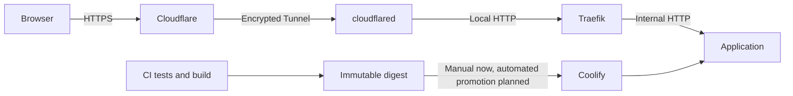

# Plan wdrożenia poprawek i standardu DevOps w repozytoriach portfolio Szczepana Greli (Wersja 13 — Coolify, 2026-09-10)

> [!NOTE]
> Ten dokument stanowi **zintegrowaną długoterminową mapę drogową (roadmapę)**. Będziemy realizować go krok po kroku (jedno repozytorium na raz). Łączy on prace programistyczne, dokumentacyjne oraz **znormalizowany standard produkcyjnego wdrożenia DevOps** dla wszystkich aplikacji internetowych i usługowych w domenie `grela.dev`.

> [!IMPORTANT]
> Kanoniczna wersja dokumentu znajduje się w publicznym repozytorium `grela-dev-roadmap`. Szczegółowe raporty i dane maszynowe projektów znajdują się w `projects/<slug>/`. Zaakceptowany standard rate limitingu opisuje [`rate-limiting-standard.md`](rate-limiting-standard.md), a maszynowo czytelne profile i kontrole v2 znajdują się w [`delivery-controls.json`](../standards/delivery-controls.json). Wartości są dobierane indywidualnie do kosztu endpointów.

---

## 🛠️ Znormalizowany Standard Architektury DevOps

Docelowy standard VPS używa Coolify, Traefika i Cloudflare Tunnel.
Tic-Tac-Toe i Inventory są już ręcznie wdrożone po digestach; automatyczne CD,
pełna weryfikacja sieci i rollbacku pozostają do wykonania. Szczegóły obsługi
panelu i ograniczeń 4.3.14: [checklista Coolify](coolify-deployment-checklist.md).
Poniższe wymagania nie stanowią deklaracji ukończenia wszystkich projektów.

### Kluczowe zasady DevOps dla przyszłych agentów AI:
1.  **Prywatny dostęp i uprawnienia:** panel Coolify i endpoint wdrożeniowy pozostają w zatwierdzonej sieci administracyjnej. Tailscale działa na hoście. Legacy transport to zwykły OpenSSH przez Tailnet, nie funkcja Tailscale SSH. Docelowy job CI przekazuje przetestowany digest do uwierzytelnionego interfejsu Coolify z minimalnym zakresem uprawnień; wdrożenie tej automatyzacji jest jeszcze zadaniem. Szczegółowe ACL, adresy i polityka SSH są w prywatnej dokumentacji infrastruktury. Jeżeli CI dołącza do Tailnet przez OIDC, sprawdzić ograniczenie repo/branch oraz przypięty SHA akcji; nie dodawać nowych legacy kont wdrożeniowych dla zasobów Coolify.
2.  **Struktura źródeł i wdrożeń:** utrzymać wersjonowany produkcyjny Dockerfile (w istniejącej lokalizacji root lub infra, zgodnej z CI), HEALTHCHECK i konfigurację aplikacji. Coolify zarządza cyklem życia i siecią; własny deploy.sh/launcher nie jest obowiązkowy. Nie pobierać ruchomych skryptów jako root, nie budować ponownie na VPS i nie wykonywać globalnego prune w deployu aplikacji. Pełne sekrety i szczegóły hosta nie należą do publicznego README.

3.  **Ochrona przed nadużyciami (Rate Limiting & DoS Protection):**
    *   **Każda publiczna aplikacja webowa** posiada zaimplementowany **Rate Limiting** zapobiegający przeciążeniom serwera, drenażowi zasobów i atakom typu DoS.
    *   Ochrona działa wielowarstwowo: reguły Cloudflare na krawędzi oraz per-aplikacyjne i per-endpointowe limity Traefika na poziomie reverse proxy (do wdrożenia i przetestowania) oraz wbudowane middleware Rate Limiting w aplikacji (.NET `Microsoft.AspNetCore.RateLimiting` / Express / FastAPI).
    *   Szczególny nacisk położony jest na endpointy generujące pliki i zużywające CPU/RAM (np. `/api/export/docx`).
4.  **Izolacja i runtime:** każda aplikacja działa jako non-root we własnej sieci zarządzanej przez Coolify, bez publikacji portu procesu na hoście i bez Docker socketa. Osobne konto w grupie docker jest root-equivalent, nie stanowi twardej izolacji i nie jest tworzone dla nowych zasobów Coolify. Po migracji usuwać stare konta/skrypty tylko po kontroli danych i zakresu; wolumeny baz pozostają chronione. Limity CPU/RAM/PID i logów dobierać do aplikacji. Stosować cap-drop ALL, init i docelowo no-new-privileges/read-only/tmpfs; ograniczenia parsera 4.3.14 oraz przyjęty wyjątek opisuje checklista. Usługi Compose pozostają na izolowanej sieci stosu, jeżeli nie potrzebują predefined network; jawna dedykowana sieć connector–proxy nie uzasadnia dostępu do współdzielonej sieci platformy.
5.  **Routing, TLS i klient:** publiczny HTTPS kończy się na Cloudflare, a zaszyfrowany tunel prowadzi do konektora. W przyjętym wariancie dalsze odcinki do Traefika i kontenera używają lokalnego HTTP. Ustawienia domeny, portu, redirectu i strip prefixes muszą odpowiadać tej ścieżce. Nie zakładać TLS do kontenera na podstawie prefiksu https w UI. Zweryfikować dokładny zaufany łańcuch connector → Traefik → aplikacja; nigdy nie ufać dowolnemu X-Forwarded-For ani CF-Connecting-IP bez granicy zaufania. Adresy Cloudflare nie są bezpośrednimi peerami aplikacji. Origin ma docelowo być niedostępny publicznie, co wymaga osobnego testu IPv4/IPv6 i publikacji Dockera. Dla wielu usług zachować semantykę tras API, kolejność matchów, websockets/SSE, body limits i timeouty. Stare NPM Custom Locations są materiałem do migracji, nie konfiguracją nowego proxy. Admin i domeny assetów/R2 wymagają osobnego zakresu.
6.  **Sekrety i retencja:** runtime secrets przechowywać w Coolify lub chronionych plikach hosta; CI credentials w odpowiednim GitHub Environment. Nie przenosić danych produkcyjnych do publicznych repo. Klucz SSH dotyczy tylko zatwierdzonej ścieżki zarządzania, z przypiętym zweryfikowanym host key. Po migracji wycofać zbędne klucze i OIDC grants; usunięcie konta na VPS samo ich nie usuwa. Zachować co najmniej ostatni sprawdzony digest i stosować retencję per aplikacja.

7.  **Niezmienny release, preflight i blue-green (obowiązkowy standard):**
    *   **Jeden build, jeden artefakt:** obraz powstaje raz w GitHub Actions po przejściu Quality, jest wysyłany do GHCR z tagiem pełnego commit SHA, a deploy używa postaci `ghcr.io/...@sha256:...`. Produkcja nie wdraża `latest`, skróconego SHA ani obrazu zbudowanego ponownie na VPS.
    *   **Manifest wydania:** wielokontenerowa aplikacja publikuje niezmienny manifest zawierający pełny `CONFIG_SHA` oraz digest każdego obrazu. Przy buildach selektywnych manifest przenosi digests niezmienionych komponentów; prostszym i bezpieczniejszym początkiem jest atomowe zbudowanie wszystkich kontenerów aplikacyjnych.
    *   **Spójność commitu:** workflow i obrazy muszą odpowiadać testowanemu SHA; release zapisuje również wersję konfiguracji/Compose i ustawień Coolify. Job nigdy nie zastępuje SHA aktualnym main.
    *   **Preflight przed zmianą ruchu:** nieaktywny slot (`blue` albo `green`) startuje równolegle pod unikalną nazwą z limitami zasobów i bez produkcyjnego aliasu. Platforma/orchestrator czeka na Docker healthcheck, odpytuje `/health/ready` i wykonuje bezpośredni smoke test krytycznych ścieżek. Nie usuwa ani nie restartuje działającego slotu. Nie wolno sprawdzić kandydata, usunąć go, a następnie uruchomić w produkcji nowego, niesprawdzonego kontenera z tego samego obrazu.
    *   **Promocja blue-green:** po udanym preflight stabilny router aplikacji przełącza upstream z aktywnego slotu na kandydata atomowym reloadem. Traefik wybiera gotowy backend w sieci aplikacji; nie dokładamy osobnego gatewaya tylko po to, by powielić tę funkcję. Rolling update platformy jest etapem przejściowym i wymaga testu zachowania przy awarii; nie nazywamy go automatycznie blue-green. Następnie wykonywany jest smoke test przez publiczny HTTPS; przy błędzie routing wraca do poprzedniego slotu. Stary slot jest zatrzymywany dopiero po okresie drain/grace i pozostaje dostępny jako ostatni release rollbacku zgodnie z retencją.
    *   **Zakres blue-green:** dublujemy stateless frontend/API. PostgreSQL, kolejki i monitoring pozostają współdzielone. Worker/orchestrator uruchamiający zadania cykliczne działa jako singleton albo używa leader election/distributed lock; dwa sloty nie mogą podwójnie wykonać tego samego zadania.
    *   **Hosting statyczny:** dla GitHub Pages/Cloudflare Pages odpowiednikiem jest preview deployment z testami, a następnie atomowa promocja i rollback zapewniane przez platformę. Nie dokładamy własnych kontenerów ani routera blue-green tam, gdzie hosting już gwarantuje niezmienne wydania.
    *   **Migracje bazy:** migracje nie uruchamiają się automatycznie przy starcie każdej repliki. Są osobnym, kontrolowanym krokiem po backupie. Stosujemy expand/contract: najpierw zmiana kompatybilna ze starą i nową wersją, później deploy kodu, a destrukcyjne usunięcia dopiero w osobnym wydaniu. Rollback aplikacji nie może wymagać cofania nieodwracalnej migracji.
    *   **Healthcheck w obrazie (obowiązkowy):** każde repozytorium hostowane jako własny kontener webowy posiada produkcyjny `Dockerfile` z instrukcją `HEALTHCHECK`. Kontrola działa wewnątrz kontenera, odpytuje jego wewnętrzny port i endpoint readiness oraz korzysta z narzędzia rzeczywiście obecnego w finalnym obrazie (`curl`, `wget` albo dedykowany probe). Nie polegamy wyłącznie na domyślnym sprawdzaniu procesu ani automatycznym wykrywaniu platformy; konfiguracja healthchecku w Coolify może uzupełniać obraz, ale nie zastępuje przenośnej kontroli zapisanej w Dockerfile. Dla obrazów zewnętrznych, których Dockerfile nie kontrolujemy, równoważny healthcheck musi być jawnie zdefiniowany w Compose/platformie i udokumentowany. Probe connectora potwierdzający połączenie z edge nie zastępuje publicznego smoke testu tras do aplikacji.
    *   **Semantyka endpointów zdrowia:** `/health/live` potwierdza tylko życie procesu; do promocji obowiązkowy jest `/health/ready` sprawdzający wymagane zależności. Prosta aplikacja bez zależności może używać jednego lekkiego endpointu readiness, np. `/api/health`. Po przełączeniu wymagany jest zewnętrzny smoke test przez pełną publiczną ścieżkę ruchu.
    *   **Blokady i współbieżność:** GitHub `concurrency` serializuje wdrożenia danego środowiska z `cancel-in-progress: false`. Platforma musi zapewnić serializację per aplikacja i kontrolę pojemności całego VPS podczas nakładania kandydatów. Zweryfikować mechanizm kolejki/blokady Coolify; dla własnych skryptów używać rzeczywistego flock. Plik z PID nie jest blokadą; samo zainstalowanie Coolify nie dowodzi spełnienia wymagania.
    *   **Budżet zasobów:** oba sloty mają jawne limity CPU, RAM i PID. Podwójne zużycie dotyczy tylko dublowanych usług w trakcie wdrożenia i okresu rollback/drain, nie bazy i pozostałych usług stanowych. Deploy nie rozpoczyna kandydata, jeżeli serwer nie ma ustalonego zapasu pamięci.
    *   **Bezpieczne sprzątanie:** brak globalnego `docker image prune -f`, brak bezwarunkowego restartu NPM i brak aktualizacji współdzielonej infrastruktury przy deployu pojedynczej aplikacji. Obrazy baz danych i monitoringu są przypięte do kontrolowanych wersji/digestów i aktualizowane osobnym procesem. Czyszczenie jest per aplikacja, po sukcesie, z zachowaniem co najmniej ostatniego działającego release'u.
    *   **Kontrola wydania:** `main` ma ruleset blokujący force-push i usunięcie oraz wymagający zielonego Quality przed scaleniem. Dla jednoosobowych repozytoriów nie wymagamy zatwierdzenia przez inną osobę: docelowy przepływ to PR bez obowiązkowego review, zielone wymagane kontrole i merge. Jeżeli projekt tymczasowo zachowuje bezpośrednie pushe na `main`, minimalny etap przejściowy blokuje force-push i usunięcie, a Quality pozostaje kontrolą po pushu; nie opisujemy tego wariantu jako pełnej ochrony przed wadliwym commitem. Deploy korzysta z GitHub Environment `production`; sekrety produkcyjne są przypisane do środowiska, uprawnienia workflow są minimalne, a klucz hosta SSH jest przypięty w `SSH_KNOWN_HOSTS`.
    *   **Kryterium akceptacji:** celowe uszkodzenie readiness kandydata nie przerywa ruchu do starej wersji; błąd publicznego smoke testu automatycznie cofa routing; ponowienie tego samego manifestu wdraża dokładnie te same digests; równoległy deploy innego repozytorium respektuje blokadę pojemności VPS.
8.  **Kontrakt automatyzacji CI → Coolify (zadanie):** Quality → pojedynczy build → GHCR digest/attestacja → uwierzytelnione żądanie promocji dokładnie tego digestu → oczekiwanie na status kandydata → publiczny smoke z rewizją → rollback przy błędzie. Serializować deploymenty środowiska, nie anulować aktywnej promocji i zachować manifest wielokontenerowy. Implementację klienta API/webhooka i jego uprawnienia dobrać po odczycie wersji Coolify oraz prywatnej polityki dostępu. Dotychczasowe ręczne wpisanie digestu nie spełnia tej automatyzacji. Nie kopiować starego joba SSH z launcherem użytkownika do aplikacji migrowanej do Coolify.

9.  **Centralna obserwowalność VPS (jeden stack dla wszystkich aplikacji):**
    *   Na jednym VPS utrzymujemy **jedną niezależną instancję Grafany, Prometheusa i Node Exportera na środowisko**, a nie ich kopię w każdym projekcie. Opcjonalne usługi, takie jak Grafana Image Renderer, cAdvisor, Loki/Alloy lub Alertmanager, również należą do centralnego stacku. Osobne instancje tworzymy dopiero dla innego środowiska, hosta, wymogu izolacji albo skali uzasadniającej federację.
    *   Stack działa z osobnego katalogu i Compose/repozytorium infrastruktury, np. `/home/observability`, pod osobnym cyklem wdrożeniowym. Deploy aplikacji nie restartuje, nie aktualizuje ani nie usuwa kontenerów obserwowalności.
    *   Grafana, renderer, Prometheus i hostowe exportery korzystają z dedykowanej zewnętrznej sieci `observability-network`. Prometheus jest dodatkowo dołączany tylko do tych izolowanych sieci aplikacji, z których musi pobierać wewnętrzne `/metrics`; pozostałe aplikacje nadal nie uzyskują wzajemnej łączności. Endpointy metryk i interfejs Prometheusa nie są publikowane do internetu, a Grafana pozostaje dostępna wyłącznie przez Tailscale lub chroniony reverse proxy.
    *   Każdy scrape target otrzymuje spójne labels: co najmniej `application`, `service`, `environment` i `instance`. Konfiguracja dzieli dashboardy i reguły alertów na foldery per aplikacja oraz zapewnia dashboardy globalne dla hosta, wszystkich kontenerów, dostępności, błędów HTTP, wykorzystania zasobów i historii deploymentów.
    *   Node Exporter działa dokładnie raz na host. Do metryk CPU/RAM/restartów poszczególnych kontenerów dodajemy jeden centralny cAdvisor, jeżeli jego koszt i zakres dostępu do Dockera zostaną zaakceptowane. Grafana Unified Alerting może pozostać mechanizmem alertów; osobny Alertmanager nie jest obowiązkowy na pojedynczym VPS.
    *   Prometheus ma ustaloną retencję, limit pamięci i budżet dysku dobrane po pomiarze cardinality całego VPS. Monitoring wolnego miejsca, OOM/restartów oraz samego Prometheusa jest obowiązkowy. Obrazy są przypięte do kontrolowanych wersji/digestów i aktualizowane niezależnie od aplikacji.
    *   Dashboardy, provisioning i reguły alertów są wersjonowane; sekrety Grafany/SMTP pozostają w pliku środowiskowym z prawami `600`. Wolumeny Grafany i Prometheusa mają backup oraz przetestowaną procedurę odtworzenia.
    *   Migracja istniejącego monitoringu odbywa się bez utraty obserwacji aplikacji: najpierw backup/snapshot i równoległy centralny kandydat na nowych nazwach/sieci, następnie porównanie scrape targets, dashboardów oraz alertów, przełączenie dostępu do Grafany i dopiero na końcu usunięcie usług z Compose aplikacji. Stary stack pozostaje dostępny do rollbacku przez ustalony okres; ewentualna krótka przerwa dotyczy wyłącznie narzędzi monitoringu, nie ruchu aplikacji.

---

## 🤝 Zasady Współpracy i Kontroli Użytkownika

> [!IMPORTANT]
> **Pełna kontrola użytkownika (Brak samodzielnych decyzji AI):**
> *   Każda zmiana w kodzie (np. logika tabel w Wordzie, interfejs NetFilmx, scrapery) będzie przedyskutowana z Tobą **przed jej zaimplementowaniem**. Agent AI nie będzie samodzielnie podejmował decyzji o architekturze ani dokonywał zmian bez Twojej wiedzy.
> *   Wszelkie commity i wypchnięcie zmian na GitHub (`git commit` / `git push`) oraz zmiany nazw repozytoriów będą wykonywane **dopiero po Twojej wyraźnej akceptacji** konkretnego pliku/kodu lub jako polecenie uruchomione przez Ciebie w terminalu.
> *   Działamy ściśle w trybie **Pair Programming** — AI proponuje rozwiązania i pisze kod do wglądu, a Ty pełnisz rolę zatwierdzającego (Driver/Navigator).

---

## 🗂️ Organizacja pracy (Rozdzielenie czatów)

Aby zapobiec przepełnieniu kontekstu (tzw. context bloating) i utrzymać wysoką wydajność:
1.  **Ten czat** służy jako **Koordynator Główny** — tu śledzimy postępy na roadmapie, zarządzamy listą zadań i podejmujemy decyzje strategiczne.
2.  **Dla każdego konkretnego kroku** zalecamy **otwieranie osobnego, świeżego czatu**. Przyszły agent AI odczytuje kanoniczny plik `/home/szcze/projects/grela-dev-roadmap/docs/implementation-plan.md` i raport danego projektu z `projects/<slug>/report.md`, a następnie dostosowuje się do standardu DevOps.

---

## Proposed Changes (Chronologiczna kolejność prac)

### 1. `Projekt-ST1-Generator-Spisu` -> `inventory-generator` — wdrożenie działa, dalsze zadania w raporcie
*   **Proponowana nazwa:** `inventory-generator`
*   **Subdomena:** `inventory-generator.grela.dev` (wdrożone; dowody w raporcie projektu)
*   **Port kontenera:** `8080`, wewnątrz sieci; bez mapowania publicznego
*   **Zarządzanie wdrożeniem:** zasób Coolify; nie tworzyć nowego konta aplikacyjnego w grupie docker.
*   **Technologia:** C# / ASP.NET Core (.NET 8), JavaScript, OpenXML; generator DOCX/CSV/HTML
*   **Zadania Dev:** Zmiana nazwy na `inventory-generator`, licencja MIT, README.md (EN). Poprawa układu tabeli w plikach MS Word (szerokość kolumn, czcionki, obramowania), aby była czytelna i schludna.
*   **Zadania DevOps:** Wdrożenie ręczne GHCR/Coolify z healthcheckiem wykonane; pozostały automatyczna promocja digestu, klient-IP, limity i testy rollbacku. Upewnienie się, że aplikacja ma favicon i wielowarstwowy rate limiting; wdrożenie obowiązkowego preflightu, blue-green i automatycznego rollbacku zgodnie ze standardem powyżej.

### 2. `Punkt_Skladania_Zamowien` (Maj 2024)
*   **Proponowana nazwa:** `pos-order-system`
*   **Dystrybucja:** Aplikacja desktopowa; bez publicznego hostingu i subdomeny.
*   **Technologia:** C# (WinForms)
*   **Zadania Dev:** Zmiana nazwy na `pos-order-system`, licencja MIT, README.md (EN) z datą, tagi, audyt znanych błędów, testy logiki oraz przygotowanie powtarzalnego wydania desktopowego.
*   **Zadania DevOps:** Quality CI dla kompilacji i testów oraz automatyzacja artefaktu wydania. Standard webowego rate limitingu, NPM, favicon i blue-green nie ma zastosowania.

### 3. `ST2-NetFilmx` (Lipiec 2024)
*   **Proponowana nazwa:** `netfilmx-movie-catalog`
*   **Subdomena:** `netfilmx.grela.dev`
*   **Port kontenera:** ustalić z Dockerfile i procesu przy migracji; bez domyślnego mapowania na hosta.
*   **Docelowe zarządzanie wdrożeniem:** zasób Coolify; nie tworzyć nowego konta aplikacyjnego w grupie docker.
*   **Technologia:** C# (ASP.NET Core MVC)
*   **Zadania Dev:** Zmiana nazwy na `netfilmx-movie-catalog`, licencja MIT, README.md (EN). Odświeżenie panelu admina (Admin UI) i dodanie estetycznego interfejsu dla zwykłych użytkowników (User UI).
*   **Zadania DevOps:** Wdrożenie kontenerowe ASP.NET Core MVC pod subdomenę `netfilmx.grela.dev`. Upewnienie się, że aplikacja ma favicon i wielowarstwowy rate limiting; wdrożenie obowiązkowego preflightu, blue-green i automatycznego rollbacku zgodnie ze standardem powyżej.

### 4. `AirQualityApp` (Luty 2025)
*   **Proponowana nazwa:** `air-quality-app`
*   **Subdomena:** `air.grela.dev`
*   **Port kontenera:** ustalić z Dockerfile i procesu przy migracji; bez domyślnego mapowania na hosta.
*   **Docelowe zarządzanie wdrożeniem:** zasób Coolify; nie tworzyć nowego konta aplikacyjnego w grupie docker.
*   **Technologia:** Python
*   **Zadania Dev:** Zmiana nazwy na `air-quality-app`, licencja MIT, README.md (EN). Implementacja brakujących funkcjonalności (zapisywanie historii pomiarów, wykresy jakości powietrza w matplotlib/plotly).
*   **Zadania DevOps:** Konteneryzacja aplikacji Python i wdrożenie pod `air.grela.dev`. Upewnienie się, że aplikacja ma favicon i wielowarstwowy rate limiting; wdrożenie obowiązkowego preflightu, blue-green i automatycznego rollbacku zgodnie ze standardem powyżej.

### 5. `AudioMaster` (Czerwiec 2025)
*   **Proponowana nazwa:** `audio-master`
*   **Technologia:** Python (GUI + ffmpeg)
*   **Zadania Dev:** Zmiana nazwy na `audio-master`, licencja MIT, README.md (EN). **Współautorstwo:** Dodanie sekcji atrybucji współautorów.

### 6. `kolkokrzyzyk` (Lipiec 2025)
*   **Proponowana nazwa:** `tic-tac-toe-ai`
*   **Subdomena:** `tictactoe.grela.dev`
*   **Port kontenera:** `8080`, wewnątrz sieci; potwierdzone w obrazie
*   **Zarządzanie wdrożeniem:** zasób Coolify; nie tworzyć nowego konta aplikacyjnego w grupie docker.
*   **Technologia:** Python
*   **Zadania Dev:** Zmiana nazwy na `tic-tac-toe-ai`, licencja MIT, README.md (EN). **Współautorstwo:** Dodanie sekcji atrybucji współautorów.
*   **Zadania DevOps:** Wdrożenie wersji webowej gry pod `tictactoe.grela.dev`. Utrzymać token bucket ruchów (30/min z burstem 10), naliczać seriom koszt według liczby gier i zachować limit dwóch równoległych operacji AI. GHCR digest i ręczne wdrożenie Coolify z readiness są potwierdzone. Zweryfikować prawdziwe IP przez Tunnel/Traefik, dokończyć limity, automatyczne CD, Redis przy nakładaniu replik i testy blue-green/rollbacku.

### 7. `SmakoszWebApp` (Lipiec 2025)
*   **Proponowana nazwa:** `smakosz-web-app`
*   **Domena:** obecnie planowane `smakosz.grela.dev`; wybrać docelową domenę i przeprowadzić kontrolowaną migrację bez wymyślania adresu przed decyzją właściciela.
*   **Docelowe zarządzanie wdrożeniem:** zasób Coolify; nie tworzyć nowego konta aplikacyjnego w grupie docker.
*   **Technologia:** C# (.NET 10) + Blazor WASM (PWA) + PyTorch/ONNX + Docker
*   **Zadania Dev:** Zmiana nazwy na `smakosz-web-app`, licencja MIT, stworzenie obszernego README.md (EN) na podstawie Twojej pracy inżynierskiej (`2026.IN.w67131.pdf`). **Naprawa e-maili:** usunąć zależność od wygasłego klucza Brevo API i przejść na SMTP Brevo przez wydzieloną abstrakcję nadawcy (np. MailKit), sekrety środowiskowe, kolejkę/retry z idempotencją oraz testy potwierdzenia konta, resetu hasła i ponownego wysłania wiadomości. Zweryfikować domenę nadawcy, SPF, DKIM i DMARC; usunąć/wycofać stare dane API i nie logować poświadczeń SMTP.
*   **Zadania DevOps:** Naprawić CI/CD zgodnie z obowiązkowym standardem: wdrażać manifest pełnego SHA i dokładne digests zamiast `latest`; nie pobierać Compose/skryptów z ruchomego `main`; połączyć zduplikowany workflow force z parametrem ręcznym; wdrożyć preflight i blue-green dla klienta/API, singleton lub bezpieczny drain dla Hangfire orchestratora oraz osobny krok migracji EF w modelu expand/contract; używać readiness zamiast samego liveness; dodać automatyczny rollback i publiczny smoke test; zastąpić pozorną blokadę prawdziwym `flock`; usunąć globalny `docker image prune -f` i restarty wspólnego proxy; utrzymać już potwierdzone ograniczenie purge do hosta frontendu, a docelowo rozważyć dokładne URL-e lub brak purge; przypiąć obrazy infrastruktury i dodać limity zasobów. **Centralna obserwowalność:** wydzielić działające `smakosz-prometheus`, `smakosz-grafana`, `smakosz-grafana-renderer` i `smakosz-node-exporter` z Compose oraz sieci Smakosza do niezależnego stacku i `observability-network`, zachowując wolumeny, dashboardy, alerty SMTP i ciągłość monitorowania Smakosza; następnie dodać scrape targets, labels, dashboardy i alerty pozostałych aplikacji. Node Exporter pozostaje pojedynczy dla całego hosta, a opcjonalny centralny cAdvisor zapewnia metryki kontenerów. Migrację wykonać równoległym kandydatem, z backupem i rollbackiem, zanim usługi zostaną usunięte ze Smakosza. **Migracja domeny:** po wyborze adresu skonfigurować Cloudflare Tunnel, Traefik/TLS, CORS, callbacki, cookie domain, linki w wiadomościach i konfigurację PWA; utrzymać stary adres przez okres przejściowy z przekierowaniem, wykonać zewnętrzne testy HTTPS i dopiero potem wycofać starą domenę. **Refaktoryzacja sieci aplikacji:** wybrać sieć aplikacji w Coolify i potwierdzić dostęp Traefika; monitoring korzysta z odrębnej `observability-network`. Upewnić się, że aplikacja ma favicon i wielowarstwowy rate limiting.

### 8. `UrlShortenerSystem` (Lipiec 2025)
*   **Proponowana nazwa:** `url-shortener-system`
*   **Subdomena:** `s.grela.dev` (lub `shortener.grela.dev`)
*   **Port kontenera:** ustalić z Dockerfile i procesu przy migracji; bez domyślnego mapowania na hosta.
*   **Docelowe zarządzanie wdrożeniem:** zasób Coolify; nie tworzyć nowego konta aplikacyjnego w grupie docker.
*   **Technologia:** C# (.NET) + HTML/JS/CSS (nowe UI)
*   **Zadania Dev:** Zmiana nazwy na `url-shortener-system`, licencja MIT, README.md (EN). Stworzenie prostego, responsywnego UI w HTML/JS do skracania linków.
*   **Zadania DevOps:** Wdrożenie produkcyjne API + UI pod subdomenę `s.grela.dev`. Upewnienie się, że aplikacja ma favicon i wielowarstwowy rate limiting; wdrożenie obowiązkowego preflightu, blue-green i automatycznego rollbacku zgodnie ze standardem powyżej.

### 9. `OlxScrapper` (Lipiec 2025)
*   **Proponowana nazwa:** `flat-finder`
*   **Subdomena:** `flatfinder.grela.dev`
*   **Port kontenera:** ustalić z Dockerfile i procesu przy migracji; bez domyślnego mapowania na hosta.
*   **Docelowe zarządzanie wdrożeniem:** zasób Coolify; nie tworzyć nowego konta aplikacyjnego w grupie docker.
*   **Technologia:** Python + HTML
*   **Zadania Dev:** Zmiana nazwy na `flat-finder`, licencja MIT, README.md (EN). Uporządkowanie skryptów ML i scrapera, dokończenie skryptu treningowego i zintegrowanie go z aplikacją.
*   **Zadania DevOps:** Wdrożenie produkcyjne dashboardu wyszukiwarki mieszkań pod `flatfinder.grela.dev`. Upewnienie się, że aplikacja ma favicon i wielowarstwowy rate limiting; wdrożenie obowiązkowego preflightu, blue-green i automatycznego rollbacku zgodnie ze standardem powyżej.

### 10. `clean-commits-skill` (Maj 2026)
*   **Nazwa:** Bez zmian (`clean-commits-skill`)
*   **Zadania Dev:** Dodanie daty do README.md, licencja MIT, tagi.

### 11. `movie-rag` (Maj 2026)
*   **Nazwa:** Bez zmian (`movie-rag`)
*   **Subdomena:** `movierag.grela.dev`
*   **Port kontenera:** ustalić z Dockerfile i procesu przy migracji; bez domyślnego mapowania na hosta.
*   **Docelowe zarządzanie wdrożeniem:** zasób Coolify; nie tworzyć nowego konta aplikacyjnego w grupie docker.
*   **Zadania Dev:** Dodanie daty do README.md, licencja MIT, schemat przepływu RAG.
*   **Zadania DevOps:** Konteneryzacja pipeline'u RAG i wdrożenie pod `movierag.grela.dev`. **Refaktoryzacja sieci:** Migracja do dedykowanej sieci Coolify z dostępem Traefika, zachowaniem bazy pgvector, tras /api/explain i zachowania streamingu. Upewnienie się, że aplikacja ma favicon i wielowarstwowy rate limiting; wdrożenie obowiązkowego preflightu, blue-green i automatycznego rollbacku zgodnie ze standardem powyżej.

### 12. `leetcode` (Czerwiec 2026)
*   **Proponowana nazwa:** `leetcode-solutions`
*   **Zadania Dev:** Zmiana nazwy na `leetcode-solutions`, licencja MIT, README.md (EN) z indeksem zadań.

### 13. `SpotifyAdBlocker` (Czerwiec 2026)
*   **Proponowana nazwa:** `spotify-ad-blocker`
*   **Zadania Dev:** Dodanie daty do README.md, licencja MIT, usunięcie plików `.idea` i `.exe`.

### 14. `grela-dev` (Lipiec 2026 - Najnowszy)
*   **Nazwa:** Bez zmian (`grela-dev`)
*   **Domena:** `grela.dev` (Główna domena)
*   **Technologia:** HTML/JS (React/JSX)
*   **Zadania Dev:** Dodanie pliku `LICENSE` (MIT) oraz pliku README.md (EN). Aktualizacja linków w kodzie strony portfolio do nowych nazw repozytoriów.
*   **Zadania DevOps:** Wdrożenie statycznego portfolio pod `grela.dev` przez Cloudflare Pages. Użyć preview deploymentów, przetestowanego niezmiennego buildu, atomowej promocji i rollbacku platformy. Skonfigurować domenę/TLS, cache/WAF, favicon, metadane i monitoring dostępności; nie dodawać kontenera VPS, NPM ani limitera aplikacyjnego bez dynamicznych endpointów.

---

## Verification Plan

### Automated Steps
- Walidacja zmian statusów i nazw repozytoriów poprzez `gh repo view`.
- Build/test/scan w CI, promocja dokładnego digestu przez Coolify; automatyczne CD pozostaje zadaniem do potwierdzenia.

### Manual Verification
- Testy dostępności usług w przeglądarce pod subdomenami `x.grela.dev` po HTTPS.
- Weryfikacja Tunnel/Traefik, HTTPS, właściwego backendu, real-IP i zamknięcia bezpośredniego originu.
- Ostateczny przegląd spójności strony portfolio `grela.dev` oraz profilu GitHub.
