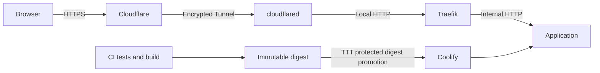

# Plan portfolio i standardu wdrożeń grela.dev (wersja 19, przegląd 2026-10-03)

> [!NOTE]
> Ten dokument jest długoterminową mapą prac portfolio i publicznym opisem standardu wdrożeń. Kolejność projektów niżej jest katalogiem, nie kolejką zmian na VPS. Stan pojedynczego projektu ma datę w jego `projects/<slug>/report.md`; starszego raportu nie należy traktować jako bieżącego odczytu produkcji.

> [!IMPORTANT]
> Publiczny plan portfolio jest tutaj. **Bieżąca checklista wykonawcza infrastruktury, jej statusy, zależności i zagnieżdżone kroki** są w prywatnym `grela-dev-infrastructure/docs/current-priorities.md`; ten dokument nie powiela prywatnych adresów ani poświadczeń. Szczegółowe raporty projektów są w `projects/<slug>/`. Zaakceptowany standard limitowania ruchu opisuje [`rate-limiting-standard.md`](rate-limiting-standard.md), a profile i kontrole v2 znajdują się w [`delivery-controls.json`](../standards/delivery-controls.json).

## Stan wdrożeń i najbliższa kolejka

Przegląd 2026-10-03 dodaje źródła/CI Inventory, przygotowany draft NetFilmx i podział sesji. Dowody VPS/backupów z 29 września i testy TTT zachowują własne daty. Nie jest nowym audytem całego VPS. Prywatna checklista zachowuje dokładne ID, zależności, adresy i dowody operatora; poniżej znajdują się pakiety prac.

| Pakiet | Co jest zrobione | Co pozostało | Zależność |
| --- | --- | --- | --- |
| Baza Coolify (`C01–C06`, `C08`) | Prywatny panel, Tunnel/Traefik; TTT i Inventory mają chronioną promocję testowanego digestu. Inventory ma własny kontrakt/atestację i zielony deploy 37091518872 na .NET 10. | Odbiór aplikacyjnych poprawek i live failure/rollback/capacity Inventory oraz pozostałe ustawienia platformy. | Zachować architekturę i daty rzeczywistych odczytów. |
| Przejście starych tras (`N01.1`, `N02`) | NPM pozostaje zatrzymany; synchronizator i stare reguły CIDR wycofano. Testy originu IPv4/IPv6 przeszły 15–16 września. | Sprawdzić trwałość wycofania po najbliższym naturalnym restarcie; nie restartować tylko dla testu. | Dalsza przerwa domen legacy jest zaakceptowana. |
| Wydanie TTT (`D01`, `D02.2`, `D03.1`) | Bramka zdrowia, odrzucenie wadliwego kandydata, failed-smoke rollback, serializacja i pomiar overlap przeszły 16–17 września. Kolejne wydania korzystają z tego procesu. 28 września publiczna seria MCTS dokończyła gry 9–10 po SIGTERM starego kontenera i dostarczyła komplet wyników. | Lokalny test potwierdził niezależne budżety i reset po wymianie. 29 września zaakceptowano ten wyjątek dla jednego procesu i krótkiego rolling overlap; wrócić do niego przed stałymi replikami lub ścisłymi kwotami. Inventory ma odrębny odbiór. | Nie powtarzać zakończonych testów jako stałego środowiska canary. |
| Funkcje TTT (`G01–G07`, `J01`) | Plansze 3×3/5×5/9×9, MCTS 5×5, odnowiony responsywny interfejs, przyrostowe serie NDJSON. Jev ma trwały licznik, backup/restore, ukończone próbki do K=9 i eksperymentalne publiczne włączenie 29 września. | Rozszerzanie wytrenowanych modeli pozostaje odroczone; monitoring i wyjątki platformy są osobne. | Zachować licznik/budżet; zwykłe CI nie wykonuje płatnych testów. |
| Edge i limity aplikacji (`D04`, `P06.1a`) | Reguła obejmuje `/api/matches/stream`; pojedynczy klient przeszedł edge 200/429/recovery. 28 września przeszły izolacja dwóch publicznych klientów aplikacji, jej budżet/recovery, przyrostowe dostarczanie streamu i anulowanie pracy potwierdzone logami VPS. Wspólna blokada TTT/Inventory i recovery również przeszły; równoległe źródła CDG/WAW zachowały niezależność. Minimum TLS 1.2 potwierdzone dla obu stref 27 września. | Różne IP w jednym centrum Cloudflare; origin TLS/ACME i przypięcie proxy osobno. TTT ma jawny wyjątek lokalnych budżetów podczas krótkiego overlap. | Odbiór limitera aplikacji nie zamyka całego D04. |
| Dane i kopie (`B01/B02/B04`, `P02`) | Zaplanowane kopie Jev/Smakosza przeszły 27 września; sprawdzono metadane Jev lokalnie/R2 i katalogi dumpów Smakosza/Coolify. UI Coolify pokazuje 7 udanych kopii S3 i 2 lokalne. | Pełna mapa danych, aktualne punkty odzyskiwania dostawcy, dokładny czas wykonania Coolify przy kolejnym odczycie, alerty oraz decyzja o nakładających się retencjach Smakosza. | Czytelny katalog nie dowodzi restore; pełny drill Coolify i pakiet kluczy pozostają odroczone. |
| Migracje (`M01 → M02 → M03`) | NetFilmx draft #1 a39d3ad: źródło zachowane, testy PostgreSQL/SQLite, durable upload, auth/CSRF/JWT, HTTP/zależności; 229 .NET + 3 DOM testy, zielone CI bez deployu. Wybrano nowy katalog R2/PG i nowe konta/pustą historię. | Trwałe Data Protection, jawne migracje/readiness, .NET 10, zastąpienie legacy deploy przed scaleniem, media/worker/recovery/cutover; potem MovieRAG/Smakosz. | Osobny Codex wykonuje NetFilmx, koordynator integruje status/platformę; stare dane/media pozostają. |
| Domknięcie (`N03`, `O01/O02`, `D05.3`) | Tymczasowe zasoby testowe TTT wycofano; PR #36 usunął stare skrypty SSH, ich testy i instrukcje fallback (D05.3). Monitoring pozostaje przy Smakoszu. | Zachować dane przy końcowym usunięciu NPM, wydzielić monitoring i przetestować alerty. | Bez globalnego prune i utraty historii. |

Pakiet → podzadanie → test odbioru. Jeden zakończony podtest nie zamyka całego pakietu. Publiczne dowody implementacji: [wydanie przez Coolify #9](https://github.com/SzczepanGrela/tic-tac-toe-ai/pull/9), [kontrola zdrowia #15](https://github.com/SzczepanGrela/tic-tac-toe-ai/pull/15), [rollback #17](https://github.com/SzczepanGrela/tic-tac-toe-ai/pull/17), [porządkowanie zasobów testowych #20](https://github.com/SzczepanGrela/tic-tac-toe-ai/pull/20), [MCTS/Jev #24](https://github.com/SzczepanGrela/tic-tac-toe-ai/pull/24), [raport oceny #33](https://github.com/SzczepanGrela/tic-tac-toe-ai/pull/33), [interfejs #34](https://github.com/SzczepanGrela/tic-tac-toe-ai/pull/34) i [przyrostowe serie #35](https://github.com/SzczepanGrela/tic-tac-toe-ai/pull/35). PR dowodzi zmiany źródła; wyniki hosta i testów zewnętrznych zachowują własne daty w prywatnej dokumentacji.

Uzupełnienie 28 września: [PR #36 TTT](https://github.com/SzczepanGrela/tic-tac-toe-ai/pull/36) dodaje testy współdzielonego budżetu endpointów, tożsamości klientów, kolejki i rzeczywistego HTTP. Publiczny strumień przekazywał gry po 1,59/3,34/4,42 s, a limit aplikacji zwrócił 429 i odzyskał dostęp po Retry-After. Późniejszy test dwóch publicznych źródeł potwierdził izolację limitera aplikacji: pierwsze otrzymało 45 odpowiedzi 429, a drugie w tym samym oknie 10/10 odpowiedzi 200 po 10 gier. Po [PR #39](https://github.com/SzczepanGrela/tic-tac-toe-ai/pull/39) skorelowano zamknięcie publicznego strumienia po grze 1 z zatrzymaniem obliczeń gry 2; gry 3–10 nie ruszyły. Późniejsza seria żądań do TTT spowodowała wspólną blokadę eksportu Inventory; oba endpointy odzyskały dostęp. Trzy blokady klienta CDG zbiegły się z 35 odpowiedziami walidacji dla klienta WAW. Ponieważ różniły się IP i centrum Cloudflare, D04 nadal obejmuje izolację różnych IP w jednym centrum. Operator 29 września zaakceptował lokalne liczniki TTT podczas krótkiego overlap; nie wdrożono wspólnych liczników. Osobna, zsynchronizowana próba rolling update potwierdziła zakończenie gier 9–10 po SIGTERM starego kontenera; klient otrzymał wszystkie 10 gier, jedno `complete` i żadnego błędu. Pierwsza próba skończyła się przed wymianą i nie stanowi dowodu drain. Nie zmieniono limitów ani nie dodano Redisa.

---

## Przydział sesji — 3 października

| Sesja | Zadanie teraz | Warunek przejścia dalej |
| --- | --- | --- |
| Codex koordynator | Review aplikacji, prywatna dokumentacja, publiczna roadmapa i wspólne ustawienia. | Weryfikacja konkretnego SHA/PR/testów; zapis tylko odebranych wyników. |
| Gemini Inventory | Poprawki HTML/null/import-cache; regresje browser i kosztów; udokumentowany odbiór wydania. | Review poprawek przez koordynatora; niesprawdzone platformowe wyjątki zostają jawne. |
| Osobny Codex NetFilmx | Przygotowany draft → stateful backend/delivery/media/recovery. | Jawne migracje/keyring i bezpieczny deploy przed produkcją; UI później. |
| Gemini portfolio, następnie | Portfolio.html → Vite/React, lokalny build, responsive/browser, Pages preview/production z jednym artefaktem. | Po przeglądzie poprawek Inventory; operator konfiguruje Pages/sekrety/domenę po przygotowaniu kandydata. |

Sesje kodują równolegle, lecz mają osobne checkouty i jeden owner na repo.
Nie dzielą automatycznie pamięci: każda prowadzi `docs/work-status.md` i raport
SHA/PR/testy/artefakt/stan produkcji/blokery/następny krok. Koordynator jest
jedynym edytorem statusu publicznego i prywatnej dokumentacji. Wspólne zmiany i
próby VPS odbywają się w jednym uzgodnionym oknie, bez globalnego prune.

Instrukcje i prompty dla sesji są w prywatnych handoffach; nie publikujemy ich
operacyjnych ścieżek ani topologii. Cloudflare pozostaje read-only dla agentów.
Portfolio jest statyczne: bez backendu, kontenera Coolify czy limitera aplikacji;
zachować obecny design i istniejące rekordy poczty. Pages metadata pozostaje
niezweryfikowane po błędzie autoryzacji. Daty/hours to estymaty pozostałego
wysiłku, a procenty są ważonym stanem zadań, nie certyfikatem bezpieczeństwa.

## 🛠️ Znormalizowany Standard Architektury DevOps

Przyjęta platforma używa Coolify, Traefika i Cloudflare Tunnel.
TTT ma zaakceptowaną automatyczną promocję przetestowanego digestu, z ręczną
bramką środowiska `production`, zarządzanym rolling update i rollbackiem.
Inventory nadal wymaga własnej akceptacji wydania. Historyczne ograniczenia
wersji 4.3.14 i procedura dla kolejnych projektów: [checklista Coolify](coolify-deployment-checklist.md).
Poniższe wymagania nie stanowią deklaracji ukończenia wszystkich projektów.

```mermaid
flowchart LR
    Browser -->|HTTPS| CF[Cloudflare]
    CF -->|Encrypted Tunnel| Connector[cloudflared]
    Connector -->|Local HTTP| Proxy[Traefik]
    Proxy -->|Internal HTTP| App[Application]
    CI[CI tests and build] --> GHCR[Immutable digest]
    GHCR -->|TTT protected digest promotion| Coolify
    Coolify --> App
```

### Kluczowe zasady wdrożeń:
1.  **Prywatny dostęp i uprawnienia:** panel Coolify i endpoint wdrożeniowy pozostają w zatwierdzonej sieci administracyjnej. Tailscale działa na hoście. Legacy transport to zwykły OpenSSH przez Tailnet, nie funkcja Tailscale SSH. TTT przekazuje przetestowany digest do prywatnego API przez chronione środowisko GitHub; automatyczne wywołanie po Quality jest zaakceptowane, a job produkcyjny wymaga zatwierdzenia. Token wdrożeniowy Coolify ma zakres zespołu, nie pojedynczej aplikacji; dalsze ograniczenie wymaga osobnego projektu. Szczegółowe ACL, adresy i polityka SSH są w prywatnej dokumentacji infrastruktury. Dla kolejnych repozytoriów sprawdzić ograniczenie OIDC do repo i chronionego środowiska lub do jawnie wybranego branch ref oraz przypięty SHA akcji; nie dodawać legacy kont wdrożeniowych dla zasobów Coolify.
2.  **Struktura źródeł i wdrożeń:** utrzymać wersjonowany produkcyjny Dockerfile (w istniejącej lokalizacji root lub infra, zgodnej z CI), HEALTHCHECK i konfigurację aplikacji. Coolify zarządza cyklem życia i siecią; własny deploy.sh/launcher nie jest obowiązkowy. Nie pobierać ruchomych skryptów jako root, nie budować ponownie na VPS i nie wykonywać globalnego prune w deployu aplikacji. Pełne sekrety i szczegóły hosta nie należą do publicznego README.

3.  **Ochrona przed nadużyciami (Rate Limiting & DoS Protection):**
    *   **Każda publiczna aplikacja webowa** posiada zaimplementowany **Rate Limiting** zapobiegający przeciążeniom serwera, drenażowi zasobów i atakom typu DoS.
    *   Ochrona działa wielowarstwowo: reguły Cloudflare na krawędzi oraz per-aplikacyjne i per-endpointowe limity Traefika na poziomie reverse proxy (do wdrożenia i przetestowania) oraz wbudowane middleware Rate Limiting w aplikacji (.NET `Microsoft.AspNetCore.RateLimiting` / Express / FastAPI).
    *   Szczególny nacisk położony jest na endpointy generujące pliki i zużywające CPU/RAM (np. `/api/export/docx`).
4.  **Izolacja i runtime:** każda aplikacja działa jako non-root we własnej sieci zarządzanej przez Coolify, bez publikacji portu procesu na hoście i bez Docker socketa. Osobne konto w grupie docker jest root-equivalent, nie stanowi twardej izolacji i nie jest tworzone dla nowych zasobów Coolify. Po migracji usuwać stare konta/skrypty tylko po kontroli danych i zakresu; wolumeny baz pozostają chronione. Limity CPU/RAM/PID i logów dobierać do aplikacji. Stosować cap-drop ALL, init i docelowo no-new-privileges/read-only/tmpfs; ograniczenia parsera 4.3.14 oraz przyjęty wyjątek opisuje checklista. Usługi Compose pozostają na izolowanej sieci stosu, jeżeli nie potrzebują predefined network; jawna dedykowana sieć connector–proxy nie uzasadnia dostępu do współdzielonej sieci platformy.
5.  **Routing, TLS i klient:** publiczny HTTPS kończy się na Cloudflare, a zaszyfrowany tunel prowadzi do konektora. W przyjętym wariancie dalsze odcinki do Traefika i kontenera używają lokalnego HTTP. Ustawienia domeny, portu, redirectu i strip prefixes muszą odpowiadać tej ścieżce. Nie zakładać TLS do kontenera na podstawie prefiksu https w UI. Zweryfikować dokładny zaufany łańcuch connector → Traefik → aplikacja; nigdy nie ufać dowolnemu X-Forwarded-For ani CF-Connecting-IP bez granicy zaufania. Adresy Cloudflare nie są bezpośrednimi peerami aplikacji. Origin ma docelowo być niedostępny publicznie, co wymaga osobnego testu IPv4/IPv6 i publikacji Dockera. Dla wielu usług zachować semantykę tras API, kolejność matchów, websockets/SSE, body limits i timeouty. Stare NPM Custom Locations są materiałem do migracji, nie konfiguracją nowego proxy. Admin i domeny assetów/R2 wymagają osobnego zakresu.
6.  **Sekrety i retencja:** runtime secrets przechowywać w Coolify lub chronionych plikach hosta; CI credentials w odpowiednim GitHub Environment. Nie przenosić danych produkcyjnych do publicznych repo. Klucz SSH dotyczy tylko zatwierdzonej ścieżki zarządzania, z przypiętym zweryfikowanym host key. Po migracji wycofać zbędne klucze i OIDC grants; usunięcie konta na VPS samo ich nie usuwa. Zachować co najmniej ostatni sprawdzony digest i stosować retencję per aplikacja.

7.  **Niezmienny release, sprawdzona promocja i rollback:**
    *   **Jeden build, jeden artefakt:** obraz powstaje raz w GitHub Actions po przejściu Quality, jest wysyłany do GHCR z tagiem pełnego commit SHA, a deploy używa postaci `ghcr.io/...@sha256:...`. Produkcja nie wdraża `latest`, skróconego SHA ani obrazu zbudowanego ponownie na VPS.
    *   **Manifest wydania:** wielokontenerowa aplikacja publikuje niezmienny manifest zawierający pełny `CONFIG_SHA` oraz digest każdego obrazu. Przy buildach selektywnych manifest przenosi digests niezmienionych komponentów; prostszym i bezpieczniejszym początkiem jest atomowe zbudowanie wszystkich kontenerów aplikacyjnych.
    *   **Spójność commitu:** workflow i obrazy muszą odpowiadać testowanemu SHA; release zapisuje również wersję konfiguracji/Compose i ustawień Coolify. Job nigdy nie zastępuje SHA aktualnym main.
    *   **Preflight przed zmianą ruchu:** w wariancie blue-green nieaktywny slot (`blue` albo `green`) startuje równolegle pod unikalną nazwą z limitami zasobów i bez produkcyjnego aliasu. Platforma/orchestrator czeka na Docker healthcheck, odpytuje `/health/ready` i wykonuje bezpośredni smoke test krytycznych ścieżek. Nie usuwa ani nie restartuje działającego slotu. Nie wolno sprawdzić kandydata, usunąć go, a następnie uruchomić w produkcji nowego, niesprawdzonego kontenera z tego samego obrazu.
    *   **Promocja blue-green:** po udanym preflight stabilny router aplikacji przełącza upstream z aktywnego slotu na kandydata atomowym reloadem. Po publicznym smoke stary slot przechodzi drain/grace; przy błędzie routing wraca do niego. Traefik wybiera gotowy backend w sieci aplikacji; nie dokładamy osobnego gatewaya tylko po to, by powielić tę funkcję.
    *   **Zarządzany rolling update:** zaakceptowaną alternatywą stosowaną przez TTT jest rolling update Coolify z bramką zdrowia. Stary kontener jest usuwany po osiągnięciu zdrowia przez kandydata. Jeżeli późniejszy publiczny smoke nie przejdzie, rollback ponownie wdraża zachowany poprzedni digest. Nie wymaga to stałych slotów blue/green ani stale uruchomionego canary; rollback obrazu zachowuje bieżące trwałe dane.
    *   **Zakres blue-green:** dublujemy stateless frontend/API. PostgreSQL, kolejki i monitoring pozostają współdzielone. Worker/orchestrator uruchamiający zadania cykliczne działa jako singleton albo używa leader election/distributed lock; dwa sloty nie mogą podwójnie wykonać tego samego zadania.
    *   **Hosting statyczny:** dla GitHub Pages/Cloudflare Pages odpowiednikiem jest preview deployment z testami, a następnie atomowa promocja i rollback zapewniane przez platformę. Nie dokładamy własnych kontenerów ani routera blue-green tam, gdzie hosting już gwarantuje niezmienne wydania.
    *   **Migracje bazy:** migracje nie uruchamiają się automatycznie przy starcie każdej repliki. Są osobnym, kontrolowanym krokiem po backupie. Stosujemy expand/contract: najpierw zmiana kompatybilna ze starą i nową wersją, później deploy kodu, a destrukcyjne usunięcia dopiero w osobnym wydaniu. Rollback aplikacji nie może wymagać cofania nieodwracalnej migracji.
    *   **Healthcheck w obrazie (obowiązkowy):** każde repozytorium hostowane jako własny kontener webowy posiada produkcyjny `Dockerfile` z instrukcją `HEALTHCHECK`. Kontrola działa wewnątrz kontenera, odpytuje jego wewnętrzny port i endpoint readiness oraz korzysta z narzędzia rzeczywiście obecnego w finalnym obrazie (`curl`, `wget` albo dedykowany probe). Nie polegamy wyłącznie na domyślnym sprawdzaniu procesu ani automatycznym wykrywaniu platformy; konfiguracja healthchecku w Coolify może uzupełniać obraz, ale nie zastępuje przenośnej kontroli zapisanej w Dockerfile. Dla obrazów zewnętrznych, których Dockerfile nie kontrolujemy, równoważny healthcheck musi być jawnie zdefiniowany w Compose/platformie i udokumentowany. Probe connectora potwierdzający połączenie z edge nie zastępuje publicznego smoke testu tras do aplikacji.
    *   **Semantyka endpointów zdrowia:** `/health/live` potwierdza tylko życie procesu; do promocji obowiązkowy jest `/health/ready` sprawdzający wymagane zależności. Prosta aplikacja bez zależności może używać jednego lekkiego endpointu readiness, np. `/api/health`. Po przełączeniu wymagany jest zewnętrzny smoke test przez pełną publiczną ścieżkę ruchu.
    *   **Blokady i współbieżność:** GitHub `concurrency` serializuje wdrożenia danego środowiska z `cancel-in-progress: false`. Platforma musi zapewnić serializację per aplikacja i kontrolę pojemności całego VPS podczas nakładania kandydatów. Zweryfikować mechanizm kolejki/blokady Coolify; dla własnych skryptów używać rzeczywistego flock. Plik z PID nie jest blokadą; samo zainstalowanie Coolify nie dowodzi spełnienia wymagania.
    *   **Budżet zasobów:** oba sloty mają jawne limity CPU, RAM i PID. Podwójne zużycie dotyczy tylko dublowanych usług w trakcie wdrożenia i okresu rollback/drain, nie bazy i pozostałych usług stanowych. Deploy nie rozpoczyna kandydata, jeżeli serwer nie ma ustalonego zapasu pamięci.
    *   **Bezpieczne sprzątanie:** brak globalnego `docker image prune -f`, brak bezwarunkowego restartu NPM i brak aktualizacji współdzielonej infrastruktury przy deployu pojedynczej aplikacji. Obrazy baz danych i monitoringu są przypięte do kontrolowanych wersji/digestów i aktualizowane osobnym procesem. Czyszczenie jest per aplikacja, po sukcesie, z zachowaniem co najmniej ostatniego działającego release'u.
    *   **Kontrola wydania — cel:** `main` ma ruleset blokujący force-push i usunięcie oraz wymagający zielonego Quality przed scaleniem. Dla jednoosobowych repozytoriów nie wymagamy zatwierdzenia przez inną osobę: docelowy przepływ to PR bez obowiązkowego review, zielone wymagane kontrole i merge. Jeżeli projekt tymczasowo zachowuje bezpośrednie pushe na `main`, minimalny etap przejściowy blokuje force-push i usunięcie, a Quality pozostaje kontrolą po pushu; nie opisujemy tego wariantu jako pełnej ochrony przed wadliwym commitem. TTT używa GitHub Environment `production` z ograniczeniem do `main` i zatwierdzeniem operatora, lecz środowisko dopuszcza jego własne zatwierdzenie i obejście przez administratora. Odczyt z 17 września potwierdził ruleset TTT wymagający PR i zielonego Quality. Brak klasycznej branch protection nie oznacza braku rulesetu. Zatwierdzenie środowiska przez właściciela jest świadomą bramką operatora, nie niezależnym review drugiej osoby. Sekrety produkcyjne są w środowisku; stary klucz SSH nie jest częścią obecnego wdrożenia Coolify.
    *   **Kryterium akceptacji:** celowe uszkodzenie readiness kandydata nie przerywa ruchu do starej wersji; błąd publicznego smoke testu uruchamia rollback właściwy dla wybranej strategii; ponowienie tego samego manifestu wdraża dokładnie te same digests; równoległy deploy innego repozytorium respektuje blokadę pojemności VPS.
8.  **Kontrakt automatyzacji CI → Coolify:** Quality → pojedynczy build → GHCR digest/atestacja → chroniona promocja dokładnie tego digestu → oczekiwanie na zdrowie → publiczny smoke z rewizją → rollback przy błędzie. TTT ma zaakceptowane automatyczne wywołanie po Quality i ręczne zatwierdzenie joba produkcyjnego. Testy niezdrowego kandydata i rollbacku po błędzie publicznego smoke przeszły 16–17 września. Przed zmianą sprawdzać stabilny kontrakt dotychczasowej wersji, a po promocji pełny kontrakt nowej. Inventory i aplikacje stanowe wymagają osobnego odbioru. Serializować deploymenty, nie anulować aktywnej promocji i zachować manifest wielokontenerowy. Nie kopiować starego joba SSH z launcherem do aplikacji Coolify.

9.  **Centralna obserwowalność VPS (jeden stack dla wszystkich aplikacji):**
    *   Na jednym VPS utrzymujemy **jedną niezależną instancję Grafany, Prometheusa i Node Exportera na środowisko**, a nie ich kopię w każdym projekcie. Opcjonalne usługi, takie jak Grafana Image Renderer, cAdvisor, Loki/Alloy lub Alertmanager, również należą do centralnego stacku. Osobne instancje tworzymy dopiero dla innego środowiska, hosta, wymogu izolacji albo skali uzasadniającej federację.
    *   Stack działa z osobnego katalogu i Compose/repozytorium infrastruktury, np. `/home/observability`, pod osobnym cyklem wdrożeniowym. Deploy aplikacji nie restartuje, nie aktualizuje ani nie usuwa kontenerów obserwowalności.
    *   Grafana, renderer, Prometheus i hostowe exportery korzystają z dedykowanej zewnętrznej sieci `observability-network`. Prometheus jest dodatkowo dołączany tylko do tych izolowanych sieci aplikacji, z których musi pobierać wewnętrzne `/metrics`; pozostałe aplikacje nadal nie uzyskują wzajemnej łączności. Endpointy metryk i interfejs Prometheusa nie są publikowane do internetu, a Grafana pozostaje dostępna wyłącznie przez Tailscale lub chroniony reverse proxy.
    *   Każdy scrape target otrzymuje spójne labels: co najmniej `application`, `service`, `environment` i `instance`. Konfiguracja dzieli dashboardy i reguły alertów na foldery per aplikacja oraz zapewnia dashboardy globalne dla hosta, wszystkich kontenerów, dostępności, błędów HTTP, wykorzystania zasobów i historii deploymentów.
    *   Node Exporter działa dokładnie raz na host. Do metryk CPU/RAM/restartów poszczególnych kontenerów dodajemy jeden centralny cAdvisor, jeżeli jego koszt i zakres dostępu do Dockera zostaną zaakceptowane. Grafana Unified Alerting może pozostać mechanizmem alertów; osobny Alertmanager nie jest obowiązkowy na pojedynczym VPS.
    *   Prometheus ma ustaloną retencję, limit pamięci i budżet dysku dobrane po pomiarze cardinality całego VPS. Monitoring wolnego miejsca, OOM/restartów oraz samego Prometheusa jest obowiązkowy. Obrazy są przypięte do kontrolowanych wersji/digestów i aktualizowane niezależnie od aplikacji.
    *   Dashboardy, provisioning i reguły alertów są wersjonowane; sekrety Grafany/SMTP pozostają w pliku środowiskowym z prawami `600`. Wolumeny Grafany i Prometheusa mają backup oraz przetestowaną procedurę odtworzenia.
    *   Migracja istniejącego monitoringu odbywa się bez utraty obserwacji aplikacji: najpierw backup/snapshot i równoległy centralny kandydat na nowych nazwach/sieci, następnie porównanie scrape targets, dashboardów oraz alertów, przełączenie dostępu do Grafany i dopiero na końcu usunięcie usług z Compose aplikacji. Stary stack pozostaje dostępny do rollbacku przez ustalony okres; ewentualna krótka przerwa dotyczy wyłącznie narzędzi monitoringu, nie ruchu aplikacji.

---

## Zasady kontroli zmian

> [!IMPORTANT]
> **Operator zatwierdza zmiany produkcyjne i decyzje architektoniczne.** Przed ich wykonaniem otrzymuje konkretną propozycję, kopię/rollback oraz test odbioru. Commity, push i zmiany nazw repozytoriów następują po jego wyraźnej akceptacji konkretnego wyniku lub poleceniu wykonania tych działań.

---

## Przekazanie pracy między sesjami

Wybierz jeden pakiet z tabeli na początku, a następnie odczytaj jego wiersze i
podzadania w prywatnej checkliście infrastruktury oraz raport projektu z
`projects/<slug>/report.md`. Zapisuj wynik przy tym samym ID wraz z datą i
źródłem. Nie twórz nowej listy zadań w opisie pojedynczego wydania; odsyłaj do
pakietu nadrzędnego. Szczegóły VPS i dane dostępu pozostają prywatne.

---

## Katalog projektów portfolio (kolejność katalogu, nie kolejka VPS)

### 1. `Projekt-ST1-Generator-Spisu` -> `inventory-generator` — wdrożenie działa, dalsze zadania w raporcie
*   **Proponowana nazwa:** `inventory-generator`
*   **Subdomena:** `inventory-generator.grela.dev` (wdrożone; dowody w raporcie projektu)
*   **Port kontenera:** `8080`, wewnątrz sieci; bez mapowania publicznego
*   **Zarządzanie wdrożeniem:** zasób Coolify; nie tworzyć nowego konta aplikacyjnego w grupie docker.
*   **Technologia:** C# / ASP.NET Core (.NET 10 LTS), JavaScript, OpenXML; generator DOCX/CSV/HTML
*   **Zadania Dev:** Zmiana nazwy na `inventory-generator`, licencja MIT, README.md (EN). Poprawa układu tabeli w plikach MS Word (szerokość kolumn, czcionki, obramowania), aby była czytelna i schludna.
*   **Stan DevOps (3 października):** .NET 10 i własny exact-digest CI/CD przez Coolify z chronioną produkcją oraz aktywnym rulesetem main/Quality gate. Publiczna rewizja 005dc25 potwierdzona. Lokalne próby odtworzyły 500 dla null i HTML injection komunikatów; Gemini poprawia walidację/import/cache oraz dodaje testy browser/kosztów. Live failed-candidate, rollback, rzeczywiste ustawienia i rolling capacity pozostają osobnymi odbiorami. Wyjątek liczników procesu jest warunkowy, bez odebranego pomiaru.

### 2. `Punkt_Skladania_Zamowien` (Maj 2024)
*   **Proponowana nazwa:** `pos-order-system`
*   **Dystrybucja:** Aplikacja desktopowa; bez publicznego hostingu i subdomeny.
*   **Technologia:** C# (WinForms)
*   **Zadania Dev:** Zmiana nazwy na `pos-order-system`, licencja MIT, README.md (EN) z datą, tagi, audyt znanych błędów, testy logiki oraz przygotowanie powtarzalnego wydania desktopowego.
*   **Zadania DevOps:** Quality CI dla kompilacji i testów oraz automatyzacja artefaktu wydania. Standard webowego rate limitingu, NPM, favicon i blue-green nie ma zastosowania.

### 3. `ST2-NetFilmx` (Lipiec 2024)
*   **Proponowana nazwa:** `netfilmx-movie-catalog`
*   **Subdomena:** `netfilmx.grela.dev`
*   **Port kontenera:** ustalić z Dockerfile i procesu przy migracji; bez domyślnego mapowania na hosta.
*   **Docelowe zarządzanie wdrożeniem:** zasób Coolify; nie tworzyć nowego konta aplikacyjnego w grupie docker.
*   **Technologia:** C# (ASP.NET Core MVC)
*   **Zadania Dev:** Zmiana nazwy na `netfilmx-movie-catalog`, licencja MIT, README.md (EN). Odświeżenie panelu admina (Admin UI) i dodanie estetycznego interfejsu dla zwykłych użytkowników (User UI).
*   **Stan i następny pakiet (M01, 3 października):** przygotowano czysty draft #1 a39d3ad z testami/security/PG/durable uploads, bez wdrożenia. Osobny Codex przejmuje trwały keyring Data Protection, jawne migracje/readiness, .NET 10 i chronione digest CI→Coolify. Nie scalać przy starym triggerze main-push SSH. Następnie dokończyć browser derivatives/licencje/seek/import istniejących mediów R2 oraz worker/restart/rolling/restore. Nowe konta i pusta historia są wybrane; zachować SQLite/originals. UI Ania Kubów po odbiorze backendu/wydania.

### 4. `AirQualityApp` (Luty 2025)
*   **Proponowana nazwa:** `air-quality-app`
*   **Subdomena:** `air.grela.dev`
*   **Port kontenera:** ustalić z Dockerfile i procesu przy migracji; bez domyślnego mapowania na hosta.
*   **Docelowe zarządzanie wdrożeniem:** zasób Coolify; nie tworzyć nowego konta aplikacyjnego w grupie docker.
*   **Technologia:** Python
*   **Zadania Dev:** Zmiana nazwy na `air-quality-app`, licencja MIT, README.md (EN). Implementacja brakujących funkcjonalności (zapisywanie historii pomiarów, wykresy jakości powietrza w matplotlib/plotly).
*   **Zadania DevOps:** Konteneryzacja aplikacji Python i wdrożenie pod `air.grela.dev`. Upewnienie się, że aplikacja ma favicon i wielowarstwowy rate limiting; wdrożenie obowiązkowego preflightu, sprawdzonej promocji i automatycznego rollbacku zgodnie ze standardem powyżej.

### 5. `AudioMaster` (Czerwiec 2025)
*   **Proponowana nazwa:** `audio-master`
*   **Technologia:** Python (GUI + ffmpeg)
*   **Zadania Dev:** Zmiana nazwy na `audio-master`, licencja MIT, README.md (EN). **Współautorstwo:** Dodanie sekcji atrybucji współautorów.

### 6. `kolkokrzyzyk` (Lipiec 2025)
*   **Proponowana nazwa:** `tic-tac-toe-ai`
*   **Subdomena:** `tictactoe.grela.dev`
*   **Port kontenera:** `8080`, wewnątrz sieci; potwierdzone w obrazie
*   **Zarządzanie wdrożeniem:** zasób Coolify; nie tworzyć nowego konta aplikacyjnego w grupie docker.
*   **Technologia:** Python
*   **Zadania Dev:** Zmiana nazwy na `tic-tac-toe-ai`, licencja MIT, README.md (EN). **Współautorstwo:** Dodanie sekcji atrybucji współautorów.
*   **Stan TTT (przegląd 29 września):** wdrożenia przez chronione GitHub Environment, OIDC i prywatne API Coolify promują przetestowany/atestowany digest. Zarządzany healthcheck, wadliwy kandydat, publiczny rollback, serializacja i overlap są zaakceptowane. Plansze 3×3/5×5/9×9, MCTS 5×5 i przyrostowe serie NDJSON działają; to strumień odpowiedzi HTTP, bez WebSocket. Jev włączono eksperymentalnie 29 września po K=9 oraz testach publicznych i zachowaniu licznika. Pozostają izolacja edge w jednym centrum, monitoring i wyjątki runtime. Lokalne limity podczas krótkiego overlap zostały zaakceptowane; publiczny streaming i przerwanie obliczeń mają datowane dowody. Stare skrypty wdrożeniowe SSH usunięto w PR #36.

### 7. `SmakoszWebApp` (Lipiec 2025)
*   **Proponowana nazwa:** `smakosz-web-app`
*   **Domena:** obecny publiczny adres `smakosz.xyz`; ewentualny `smakosz.grela.dev` pozostaje osobną decyzją i migracją, bez wymyślania nowego adresu przed decyzją właściciela.
*   **Docelowe zarządzanie wdrożeniem:** zasób Coolify; nie tworzyć nowego konta aplikacyjnego w grupie docker.
*   **Technologia:** C# (.NET 10) + Blazor WASM (PWA) + PyTorch/ONNX + Docker
*   **Zadania Dev:** Zmiana nazwy na `smakosz-web-app`, licencja MIT, stworzenie obszernego README.md (EN) na podstawie Twojej pracy inżynierskiej (`2026.IN.w67131.pdf`). **Naprawa e-maili:** usunąć zależność od wygasłego klucza Brevo API i przejść na SMTP Brevo przez wydzieloną abstrakcję nadawcy (np. MailKit), sekrety środowiskowe, kolejkę/retry z idempotencją oraz testy potwierdzenia konta, resetu hasła i ponownego wysłania wiadomości. Zweryfikować domenę nadawcy, SPF, DKIM i DMARC; usunąć/wycofać stare dane API i nie logować poświadczeń SMTP.
*   **Stan i pakiety M03/O01–O02:** harmonogram i wykonanie lokalnego backupu przeszły 27 września; katalogi bieżących kopii daily/weekly są czytelne, bez nowej próby restore. Starsze odczyty potwierdzały działające kontenery i niedostępną trasę przez zatrzymane NPM; pomyślny handshake TLS 27 września nie potwierdza dostępności HTTP. Przed migracją odświeżyć kopię DB oraz ustalić pozostałe dane/model/konfigurację; testować `/api` i `/api/`, auth, wspólne limity, websockety, assety/PWA oraz rollback. **Wydanie stanowe:** naprawić CI/CD zgodnie ze standardem: manifest pełnego SHA i dokładne digests zamiast `latest`, bez pobierania Compose/skryptów z ruchomego `main`; połączyć zdublowany workflow force; preflight/rolling albo sprawdzony blue-green dla klienta/API, singleton/drain orchestratora, osobne kompatybilne migracje EF, publiczny smoke i rollback, rzeczywista blokada, bez globalnego prune i restartu proxy. **Centralna obserwowalność:** wydzielić Prometheus/Grafanę/renderera/Node Exporter do niezależnego stacku z zachowaniem danych, dashboardów i alertów, a następnie objąć pozostałe aplikacje. **Zmiana domeny:** dopiero po decyzji właściciela zmienić Tunnel/Traefik, CORS/callbacki/cookies, linki e-mail i PWA, zachować stary adres przejściowo i przetestować oba. Favicon i wielowarstwowe limity pozostają osobnymi odbiorami.

### 8. `UrlShortenerSystem` (Lipiec 2025)
*   **Proponowana nazwa:** `url-shortener-system`
*   **Subdomena:** `s.grela.dev` (lub `shortener.grela.dev`)
*   **Port kontenera:** ustalić z Dockerfile i procesu przy migracji; bez domyślnego mapowania na hosta.
*   **Docelowe zarządzanie wdrożeniem:** zasób Coolify; nie tworzyć nowego konta aplikacyjnego w grupie docker.
*   **Technologia:** C# (.NET) + HTML/JS/CSS (nowe UI)
*   **Zadania Dev:** Zmiana nazwy na `url-shortener-system`, licencja MIT, README.md (EN). Stworzenie prostego, responsywnego UI w HTML/JS do skracania linków.
*   **Zadania DevOps:** Wdrożenie produkcyjne API + UI pod subdomenę `s.grela.dev`. Upewnienie się, że aplikacja ma favicon i wielowarstwowy rate limiting; wdrożenie obowiązkowego preflightu, sprawdzonej promocji i automatycznego rollbacku zgodnie ze standardem powyżej.

### 9. `OlxScrapper` (Lipiec 2025)
*   **Proponowana nazwa:** `flat-finder`
*   **Subdomena:** `flatfinder.grela.dev`
*   **Port kontenera:** ustalić z Dockerfile i procesu przy migracji; bez domyślnego mapowania na hosta.
*   **Docelowe zarządzanie wdrożeniem:** zasób Coolify; nie tworzyć nowego konta aplikacyjnego w grupie docker.
*   **Technologia:** Python + HTML
*   **Zadania Dev:** Zmiana nazwy na `flat-finder`, licencja MIT, README.md (EN). Uporządkowanie skryptów ML i scrapera, dokończenie skryptu treningowego i zintegrowanie go z aplikacją.
*   **Zadania DevOps:** Wdrożenie produkcyjne dashboardu wyszukiwarki mieszkań pod `flatfinder.grela.dev`. Upewnienie się, że aplikacja ma favicon i wielowarstwowy rate limiting; wdrożenie obowiązkowego preflightu, sprawdzonej promocji i automatycznego rollbacku zgodnie ze standardem powyżej.

### 10. `clean-commits-skill` (Maj 2026)
*   **Nazwa:** Bez zmian (`clean-commits-skill`)
*   **Zadania Dev:** Dodanie daty do README.md, licencja MIT, tagi.

### 11. `movie-rag` (Maj 2026)
*   **Nazwa:** Bez zmian (`movie-rag`)
*   **Subdomena:** `movierag.grela.dev`
*   **Port kontenera:** ustalić z Dockerfile i procesu przy migracji; bez domyślnego mapowania na hosta.
*   **Docelowe zarządzanie wdrożeniem:** zasób Coolify; nie tworzyć nowego konta aplikacyjnego w grupie docker.
*   **Zadania Dev:** Dodanie daty do README.md, licencja MIT, schemat przepływu RAG.
*   **Stan i następny pakiet (M02):** stare kontenery i baza pgvector pozostawały uruchomione 12 września, ale publiczny host zwracał błąd przy zatrzymanym NPM; nowej trasy w Traefiku nie potwierdzono. Przed migracją skopiować bazę/wektory i ustalić stan zewnętrzny, potem zachować dokładne oraz prefiksowe `/api/explain`, priorytet frontend/API, streaming/SSE, anulowanie, timeouty i websockety. Sprawdzić prawdziwe zapytania, favicon, limity i rollback przed wycofaniem starej wersji.

### 12. `leetcode` (Czerwiec 2026)
*   **Proponowana nazwa:** `leetcode-solutions`
*   **Zadania Dev:** Zmiana nazwy na `leetcode-solutions`, licencja MIT, README.md (EN) z indeksem zadań.

### 13. `SpotifyAdBlocker` (Czerwiec 2026)
*   **Proponowana nazwa:** `spotify-ad-blocker`
*   **Zadania Dev:** Dodanie daty do README.md, licencja MIT, usunięcie plików `.idea` i `.exe`.

### 14. `grela-dev` (Lipiec 2026 - Najnowszy)
*   **Nazwa:** Bez zmian (`grela-dev`)
*   **Domena:** `grela.dev` (Główna domena)
*   **Technologia:** HTML/JS (React/JSX)
*   **Zadania Dev:** Dodanie pliku `LICENSE` (MIT) oraz pliku README.md (EN). Aktualizacja linków w kodzie strony portfolio do nowych nazw repozytoriów.
*   **Zadania DevOps:** Wdrożenie statycznego portfolio pod `grela.dev` przez Cloudflare Pages. Użyć preview deploymentów, przetestowanego niezmiennego buildu, atomowej promocji i rollbacku platformy. Skonfigurować domenę/TLS, cache/WAF, favicon, metadane i monitoring dostępności; nie dodawać kontenera VPS, NPM ani limitera aplikacyjnego bez dynamicznych endpointów.

---

## Verification Plan

### Automated Steps
- Walidacja JSON, zgodności raportów i kompilacji strony roadmapy.
- TTT: CI testuje kod i finalny obraz; zatwierdzony proces promuje dokładny digest.
  Niezdrowy kandydat i failed-smoke rollback mają datowaną akceptację 16–17 września.
- Inventory i kolejne aplikacje: własny kontrakt obrazu/zdrowia/smoke oraz odbiór
  promocji i odzyskiwania; nie dziedziczą wyników TTT.

### Manual Verification
- Testy dostępności usług w przeglądarce pod subdomenami `x.grela.dev` po HTTPS.
- Weryfikacja Tunnel/Traefik, HTTPS, właściwego backendu, real-IP i zamknięcia bezpośredniego originu.
- Ostateczny przegląd spójności strony portfolio `grela.dev` oraz profilu GitHub.

## Dokumentacja operacyjna — punkt wejścia

Przegląd 29 września: prywatne repo infrastruktury jest źródłem prawdy dla
konfiguracji, kart projektów, wyjątków i dowodów. `docs/current-state.md`
prowadzi do ustawień, `docs/projects/README.md` obejmuje całe portfolio i
środowiska, a `docs/current-priorities.md` pozostaje jedynym backlogiem
infrastruktury. Ten publiczny plan nie duplikuje topologii ani sekretów.
Wdrożenia projektów lokalnych/desktopowych i docelowe adresy nie są dowodem
działających usług. Dotyczy to także docelowej domeny Smakosza z roadmapy;
jej zmiana wymaga osobnej decyzji i testów, zgodnie z M03.

TTT PR #37/#38 i finalny Quality/deploy 36508939688 przeszły 29 września.
SDK 0.7.1 ma zgodny produkcyjny lock. Zaakceptowany wyjątek lokalnego limitera
zamyka zakres zadania `blue-green-redis` bez instalowania Redisa; identyfikator
pozostaje dla ciągłości historii. Odczyt VPS uzupełnia runtime i świeżość kopii,
nie zastępuje izolowanego restore ani odbioru pozostałych aplikacji.
